# 🏗️ Rolnopol — Architecture & Communication Design

> A technical companion to the [README](./README.md). This document explains **how Rolnopol is built** and **how its components talk to each other**, with diagrams rendered directly on GitHub via [Mermaid](https://mermaid.js.org/).

Rolnopol is a single-process **Express.js** application that serves a static multi-page frontend, a versioned **REST API**, and two independent **WebSocket** channels — all backed by a set of **JSON files acting as a database**. It is intentionally feature-rich (and intentionally buggy in places) to act as a realistic playground for test automation.

## Table of Contents

- [1. High-Level Overview](#1-high-level-overview)
- [2. Layered Architecture](#2-layered-architecture)
- [3. Runtime Bootstrap](#3-runtime-bootstrap)
- [4. Request Lifecycle (Middleware Pipeline)](#4-request-lifecycle-middleware-pipeline)
- [5. REST API Surface](#5-rest-api-surface)
- [6. Authentication & Authorization](#6-authentication--authorization)
- [7. Data Layer](#7-data-layer)
- [8. Real-Time Communication (WebSockets)](#8-real-time-communication-websockets)
- [9. Notification Center](#9-notification-center)
- [10. Feature Flags](#10-feature-flags)
- [11. Plugin Runtime](#11-plugin-runtime)
- [12. Chaos Engine](#12-chaos-engine)
- [13. Farm Defence (FD) Game Subsystem](#13-farm-defence-fd-game-subsystem)
- [14. Directory Map](#14-directory-map)

---

## 1. High-Level Overview

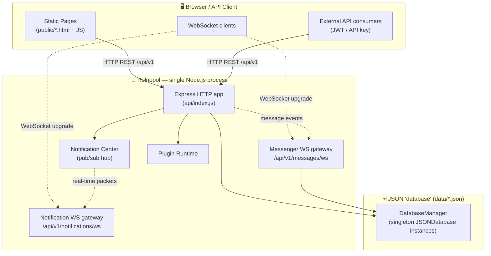

Everything runs inside **one Node process**. The HTTP server (`http.createServer(app)`) is shared with both WebSocket gateways via the HTTP `upgrade` event, so there is a single listening port (default **3000**).

---

## 2. Layered Architecture

Rolnopol follows a conventional **routes → controllers → services → data** layering, with cross-cutting modules (auth, feature flags, notifications, plugins) injected through middleware.

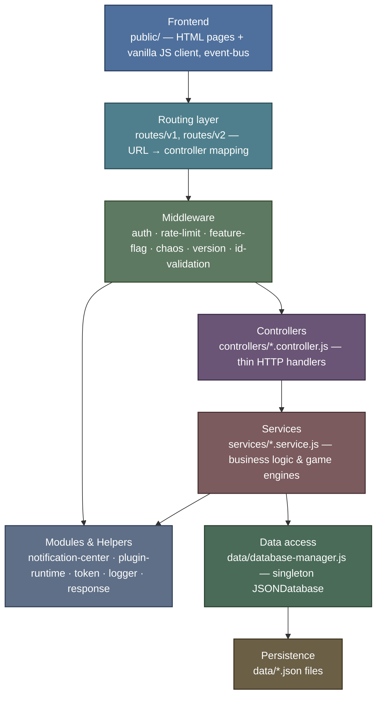

**Design principles in play:**

| Principle                 | Where it shows up                                                                         |
| ------------------------- | ----------------------------------------------------------------------------------------- |
| **Thin controllers**      | Controllers parse the request and delegate; logic lives in services.                      |
| **Singleton databases**   | `DatabaseManager` hands out one `JSONDatabase` per resource to serialize writes.          |
| **Runtime toggles**       | Feature flags gate routes & UI pages without redeploys.                                   |
| **Defensive loading**     | If `fd.route` (or other optional modules) fails to load, the app still boots with a stub. |
| **Authoritative server**  | Game state (e.g. Farm Defence) lives server-side; clients send actions only.              |
| **Event-driven realtime** | The Notification Center is a pub/sub hub feeding the WebSocket gateways.                  |

---

## 3. Runtime Bootstrap

What happens when you run `npm start` (`api/index.js`):

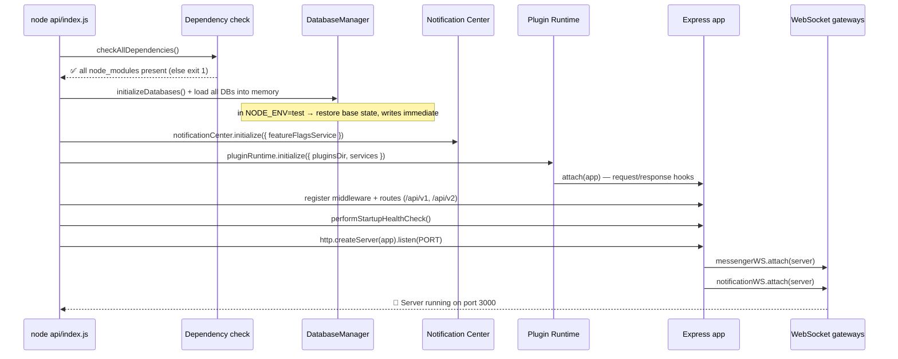

A guard middleware (`api/index.js:175`) holds incoming requests until `dbInitializationPromise` resolves, returning **503** if initialization is still in progress. **SIGINT / SIGTERM / SIGHUP** trigger a graceful shutdown that stops plugins, closes both WebSocket gateways, stops the Notification Center, and flushes databases.

---

## 4. Request Lifecycle (Middleware Pipeline)

Every HTTP request flows through an ordered middleware chain before reaching a controller.

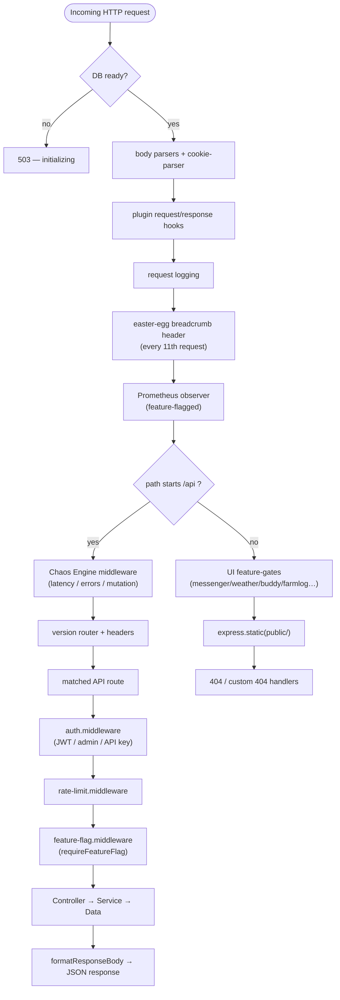

> Not every API route uses every middleware — `auth`, `rate-limit`, and `feature-flag` are applied **per-route** inside the route files. The Chaos Engine, version, logging, and Prometheus middleware are **global** for `/api`.

---

## 5. REST API Surface

All API routes are version-prefixed. `routes/v1/index.js` aggregates ~40 route modules under `/api/v1`; `routes/v2` exposes a minimal versioned surface. The version middleware (`middleware/version.middleware.js`) handles `/api` routing and version headers.

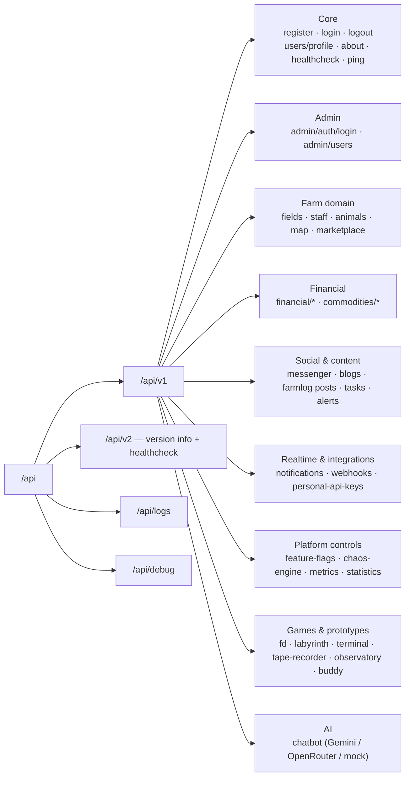

Response bodies are normalized through `helpers/response-helper.js` (`sendSuccess` / `sendError` / `formatResponseBody`). OpenAPI/Swagger is served from `/swagger.html` and `/schema/openapi.json`.

A typical authenticated REST call:

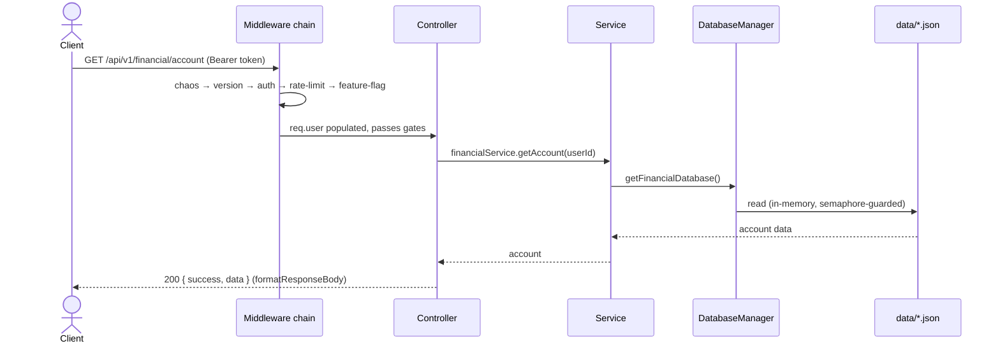

---

## 6. Authentication & Authorization

Rolnopol supports **three** auth mechanisms, all resolved in `middleware/auth.middleware.js` and backed by `helpers/token.helpers.js` (JWT) + `data/session-tokens.json` (revocation list).

| Mechanism            | Credential location                                                | Token store              | Expiry  | Use                             |
| -------------------- | ------------------------------------------------------------------ | ------------------------ | ------- | ------------------------------- |
| **User JWT**         | `Authorization: Bearer`, `token` header, or `rolnopolToken` cookie | `session-tokens.json`    | 24h     | Normal user endpoints           |
| **Admin JWT**        | Bearer / `token` body / `krakenToken` cookie                       | `session-tokens.json`    | 1h      | Admin panel & platform controls |
| **Personal API key** | `x-api-key` header                                                 | `personal-api-keys.json` | per-key | Scoped programmatic access      |

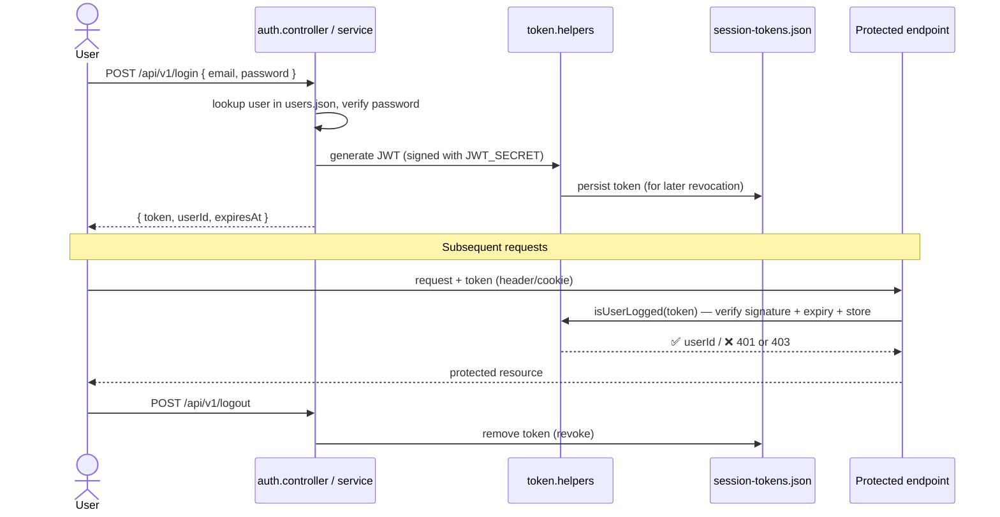

API-key requests follow the same gate but resolve to `req.auth = { type: "api-key", scopes }`, and endpoints check the key carries the required **scope** (e.g. `read:financial`). Admin login is additionally protected by attempt-limiting (3 tries, 1-minute block).

> 🔐 Demo passwords are stored in **plain text** by design — this app is a testing target, not a security reference. The `JWT_SECRET` defaults to an insecure value and should be overridden via env var.

---

## 7. Data Layer

There is no SQL/NoSQL engine — each entity is a JSON file under `data/`, wrapped by a `JSONDatabase` class and handed out as a **singleton** by `data/database-manager.js`.

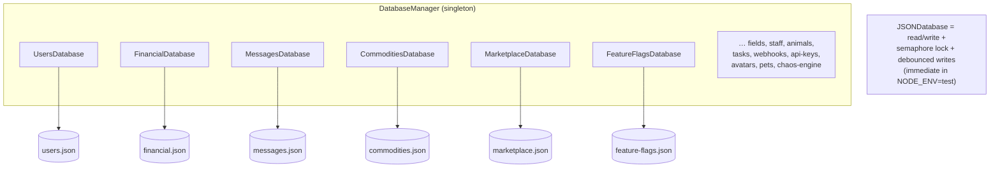

Key behaviors:

- **One instance per resource** prevents concurrent-write corruption of a JSON file.
- Writes are **debounced** (`JSON_DB_WRITE_DEBOUNCE_MS`) in normal mode, **immediate** in tests.
- On startup all databases are loaded into memory; in `NODE_ENV=test` they are restored from a **base state** (`debug-database-restore.service.js`) for deterministic tests.

---

## 8. Real-Time Communication (WebSockets)

Two **independent** WebSocket gateways share the HTTP server via the `upgrade` event. Each authenticates the upgrade request (JWT), enforces per-IP and per-user rate limits, caps payloads at 16 KB, and runs a 30-second heartbeat sweep to drop stale sockets.

| Gateway           | Path                       | Source file                           | Purpose                                                        |
| ----------------- | -------------------------- | ------------------------------------- | -------------------------------------------------------------- |
| **Messenger**     | `/api/v1/messages/ws`      | `services/messenger-ws.service.js`    | Live chat: new messages, `messagesRead`, `relationshipChanged` |
| **Notifications** | `/api/v1/notifications/ws` | `services/notification-ws.service.js` | Platform notifications, fed by the Notification Center         |

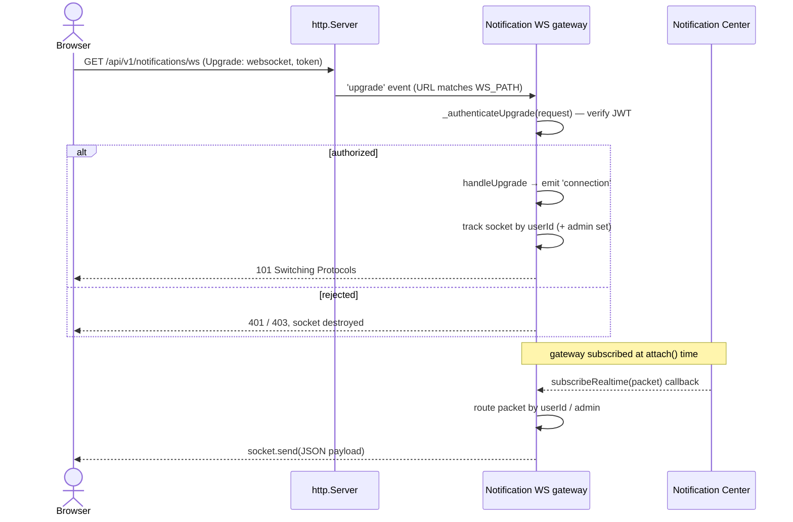

The Messenger gateway additionally **listens to message-domain events** (`relationshipChanged`, `messagesRead`) and fans them out to the affected users' sockets (a user may have multiple connections, tracked as `userId → Set<WebSocket>`).

---

## 9. Notification Center

`modules/notification-center/index.js` is an in-process **publish/subscribe hub** with an event log. It decouples producers (controllers, plugins, game engines) from the real-time transport (the Notification WS gateway).

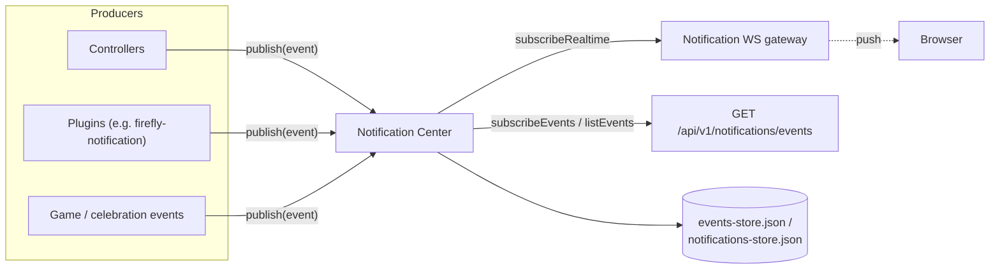

Events have the shape `{ type, source, payload, timestamp }`. The whole subsystem is gated behind the `notificationCenterEnabled` feature flag, and exposes REST endpoints for health, listing events, and triggering test events.

---

## 10. Feature Flags

`data/feature-flags.json` + `services/feature-flags.service.js` provide runtime toggles for dozens of features (messenger, weather, commodities trading, farmlog, pet buddy, Prometheus metrics, promo adverts, etc.). They gate behavior at **three** levels:

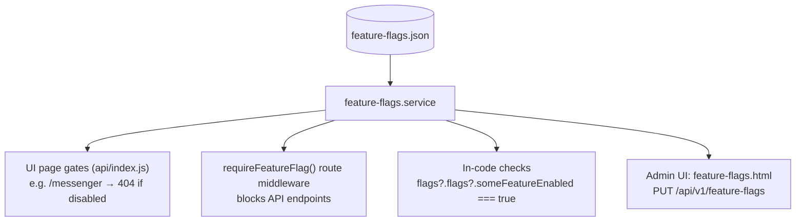

Toggling a flag takes effect on the **next request** — no restart needed (e.g. the Prometheus observer hot-toggles).

---

## 11. Plugin Runtime

`modules/plugin-runtime/index.js` discovers plugins in `plugins/`, resolves their enabled-state from a precedence chain, and attaches their hooks/routes to Express. Plugins receive injected services (`featureFlagsService`, `notificationCenter`).

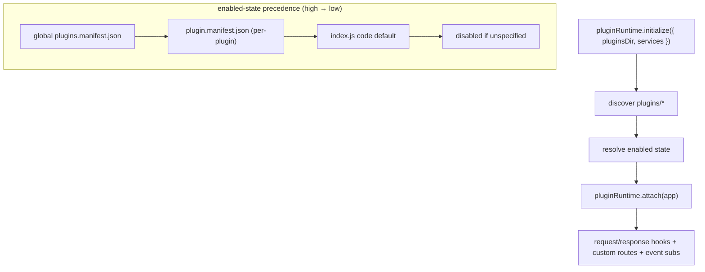

Bundled plugins include easter eggs and observability helpers: `teapot-blocker` (HTTP 418), `secret-garden-route`, `harvest-moon-header`, `firefly-notification`, `response-size-logger`, `starlit-statistics`, `feature-flag-watcher`, and a `plugin-template` for new ones.

---

## 12. Chaos Engine

`middleware/chaos-engine.middleware.js` + `services/chaos-engine.service.js` inject controlled failures (latency, errors, data mutation) into `/api` traffic based on configurable, runtime-reconfigurable rules (`data/chaos-engine.json`). It exists to make the API a **realistic, occasionally-flaky** target for resilience and retry testing, and has an admin UI (`chaos-engine.html`).

---

## 13. Farm Defence (FD) Game Subsystem

The most complex recent feature is **Farm Defence**, a server-authoritative tower-defense game under `services/fd/`. The client (`public/operator/fd.html`) only sends actions and renders snapshots; all simulation runs on the server, which makes the leaderboard tamper-resistant.

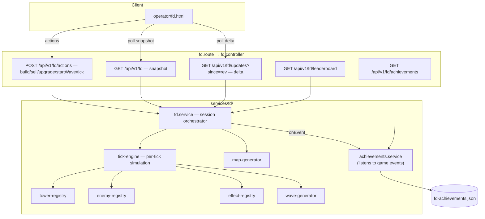

**Anti-cheat design:** achievements and leaderboard scores are computed from the **server-owned game state** (`state.stats`), never from client claims. The achievements service tracks a per-session baseline and only unlocks on positive deltas from actual gameplay. Sessions are isolated by a `sessionId` (default `"default"`), and snapshots carry a `revision` so clients can request only deltas via `/fd/updates?since=`.

The subsystem is **defensively loaded**: if `fd.service` fails to import, `fd.route` mounts stub routes returning **503**, and if the achievements service fails the core game still runs.

---

## 14. Directory Map

```
rolnopol-jt/
├── api/index.js              # entry point: bootstrap, middleware, server, WS attach
├── routes/
│   ├── v1/                   # ~40 route modules → controllers (the main API)
│   ├── v2/                   # minimal versioned surface
│   ├── logs.route.js · debug.route.js · contact.route.js
├── controllers/              # thin HTTP handlers (*.controller.js)
├── services/                 # business logic & engines (*.service.js)
│   ├── messenger-ws.service.js · notification-ws.service.js   # WS gateways
│   ├── chatbot/              # LLM providers/connectors/bots
│   └── fd/                   # Farm Defence engine (tick, registries, generators)
├── middleware/               # auth · rate-limit · feature-flag · chaos · version · id-validation
├── modules/
│   ├── notification-center/  # pub/sub hub + event log
│   ├── plugin-runtime/       # plugin discovery & lifecycle
│   ├── farm-stay/            # app-side HTTP client of the FarmStay gateway (gateway URL only)
│   ├── agri-academy/         # app-side HTTP clients of the AgriAcademy gateways (exam-center + authoring)
│   └── greenhouse/ · tasklab/ # app-side clients of the gRPC external services
├── external-services/        # standalone microservice ecosystems, independent of the app
│   ├── farm-stay/            # 5 services (REST gateway + inventory/pricing/reservation/review leaves)
│   ├── agri-academy/         # 5 services (exam-center + authoring REST gateways; question-bank/grading gRPC + certificate-issuer REST leaves)
│   ├── greenhouse/           # gRPC crop-simulation service
│   └── tasklab/              # gRPC task-board service
├── plugins/                  # optional plugins + plugins.manifest.json
├── helpers/                  # token · response · logger · validators · healthcheck · metrics
├── data/
│   ├── *.json                # the "database" (users, financial, tasks, …)
│   ├── database-manager.js   # singleton JSONDatabase registry
│   ├── json-database.js      # base read/write + locking class
│   └── settings.js           # centralized config (PORT, JWT_SECRET, rate limits, …)
├── public/                   # frontend: *.html pages, js/, css/, operator/ games, swagger
└── tests/                    # vitest unit + property-based tests
```

### External-service ecosystems

`external-services/` holds self-contained microservice ecosystems that **do not import from the Rolnopol app** — the app talks to each only over the wire (gRPC or REST) via a thin app-side client under `modules/`, all gated by feature flags. The largest is **FarmStay** (`farmStayEnabled`): a booking.com-style stays marketplace of five services — a thin REST **stay-gateway** (owns no data) orchestrating four leaves (**inventory** + **reservation** over gRPC, **pricing** + **review-desk** over REST). The gateway is the only service Rolnopol dials; see [`external-services/farm-stay/README.md`](./external-services/farm-stay/README.md) and its `PRD.md` for the full design (atomic date-range holds, TTL expiry, the price-change handshake, cancellation refund windows, and cross-service release repair). Run it with `npm run farmstay`; test it with `npm run farmstay:test`.

**AgriAcademy** (`agriAcademyEnabled`) is a timed-certification-exam ecosystem of **five** services that deliberately **mixes protocols**: two REST gateways Rolnopol dials — the **exam-center** (taking exams: sessions, two server-side clocks, attempt limits, grading + certificate orchestration) and the **authoring-service** (certification units, exam definitions, typed-question authoring, public unit pages) — orchestrating three leaves: **question-bank** and **grading** over gRPC and a **certificate-issuer** over REST. Money is never in the ecosystem: a paid exam is settled in ROL by the Rolnopol taker bridge (`routes/v1/agri-academy.route.js`) against `services/financial.service` — charge-the-taker/pay-the-unit/refund keyed by `referenceId`, with a `POST /reconcile` backstop (the farm-stay model). See [`external-services/agri-academy/README.md`](./external-services/agri-academy/README.md) and its `PRD.md` for the full design (pay-before-exam, the access-window + completion-window clocks, attempt cooldown locks, typed-question registry, idempotent certificate issuance, and aggregate health). Run it with `npm run academy`; test it with `npm run academy:test`.

---

> 📌 **Keeping this current:** when you add a route module, a WebSocket channel, a feature flag, or a new `services/fd/*` component, update the relevant diagram above. The diagrams are plain Mermaid in this Markdown file and render automatically on GitHub.

_Built with ❤️💚 for the Playwright and test automation community — see the [README](./README.md) for setup, deployment, and learning resources._
