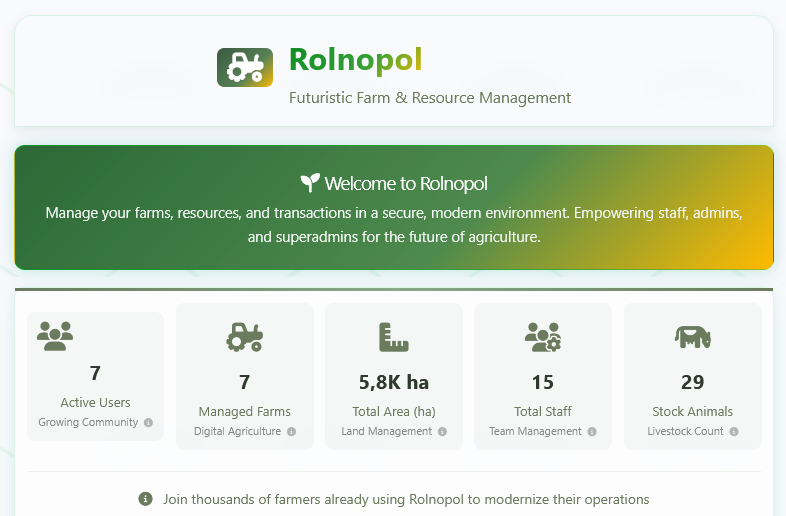

# Introduction

<p align="center">
  
</p>

> [!TIP]
> 💡 Choose your language:
>
> - 🇬🇧 [English](./README.md)
> - 🇵🇱 [Polski](./README.pl.md)

This application (called **🌱 Rolnopol**) was prepared and developed **only for testing purposes**. It provides:

- A graphical user interface (GUI)
- REST API
- Integrated Swagger documentation

The application includes features such as logic, resource management, authorization, statistics and charts. It is intentionally designed with **deliberately bugs**🐛 and challenges to simulate real-world project complexities.

**🌱 Rolnopol** is ideal for learning test automation, refining QA techniques, and practicing with scenarios encountered in diverse, **real-world projects** with diverse real-world scenarios.

# Table of Contents

- [Introduction](#introduction)
- [Features](#features)
- [Deployment](#deployment)
- [Contact & Support](#-contact--support)

# Features

🌱 **Rolnopol** is a realistic farming management application built specifically for practicing test automation in a real-world domain. It simulates complex business workflows while providing an architecture perfect for testing various automation scenarios.

## 🏗️ Architecture for Testing

- **Express.js Framework** with modular middleware (authentication, rate limiting, logging)
- **Versioned REST APIs** (v1/v2) for testing API evolution and compatibility
- **JSON File Database** for easy data manipulation and test state control
- **Layered Architecture**: routes → controllers → services → data access

## 🧪 Testing Scenarios & Challenges

- **Authentication & Authorization**: tokens, role-based access, session management
- **API Testing**: CRUD operations, data validation, error handling, rate limiting
- **Business Logic**: Financial transactions, marketplace workflows, resource management
- **UI & Integration**: Web interfaces, real-time updates, end-to-end workflows

## 🎯 Domain-Specific Testing Practice

- **Agricultural Business**: Farm management, livestock operations, staff coordination
- **Financial Operations**: Digital banking, payment systems, financial reporting
- **Data Processing**: Weather integration, performance metrics, analytics

## 🎮 Learning Through Challenges

- **Intentional Bugs** for debugging and error handling practice
- **Edge Cases** requiring thorough test coverage
- **Progressive Difficulty** from basic CRUD to complex workflows
- **Real-world Scenarios** simulating production application behavior

This architecture provides a perfect playground for practicing modern test automation techniques while working with realistic business domains and complex system interactions.

# Deployment

Instructions how to deploy presented service to various free hosting sites.

- [Deploy to Local](#deploy-on-local) (recommended)
- [Deploy using Docker image](#deploy-using-docker-image)

## Deploy on **Local**

Requirements:

- **node.js** [https://nodejs.org/](https://nodejs.org/) - installed in the system -
  - tested on node.js **v22** and **v24**
- **git** [https://git-scm.com/](https://git-scm.com/) - installed in the system

### First use

Steps:

1. Open the project root directory in cmd/terminal
1. Clone the repository using `git clone ...`
   - this is the **preferred way** to use this application
1. Run `npm i`
   - to install modules (don't use node.js global packages!)
1. Run `npm run start`
   - to start **🌱 Rolnopol**

The application will be available at `http://localhost:3000`

### Update version

#### If You are using zip package

Steps:

1. Download zipped repository
1. Unzip and replace Your local instance of **🌱 Rolnopol**
1. Run `npm i` in root directory
   - to install new modules
1. Run `npm run start`
   - to start **🌱 Rolnopol**

#### If You are using cloned repository

Steps:

1. Open the project root directory in cmd/terminal
1. Pull latest changes using `git pull`
1. Run `npm i`
   - to install new modules
1. Run `npm run start`
   - to start **🌱 Rolnopol**

### Update version if You have any changes (e.g. in database)

One possibility is to reset all Your local changes and pull new version.Using this method **You will lose all Your local changes and data**!

Steps:

1. Open the project root directory in cmd/terminal
1. Reset local changes and pull latest changes using:
   ```
   git reset --hard HEAD
   git pull
   ```
1. Run `npm i`
   - to install new modules
1. Run `npm run start`
   - to start **🌱 Rolnopol**

## Deploy to **Render**

Render - a popular Heroku-like PaaS with a free tier and a “Deploy to Render” button for one-click deploys.

- Create free account on: https://dashboard.render.com/register
- After successful registration hit the button:

[](https://render.com/deploy?repo=https://github.com/jaktestowac/rolnopol)

- name your app
- hit `Apply`
- wait a while and click link to project `Rolnopol`
- click link to open app (under project name and repository)
- enjoy 750 free hours of service per month

When deploying the **🌱 Rolnopol** application on Render, please be aware that the application may not function fully due to the limitations of the Render platform. However, we are making every effort to ensure the highest possible compatibility.

## Deploy using Docker image

This method can be used:

- locally
- in CI/CD services (GitHub Actions, GitLab CI etc.)

### Prerequisites:

On local environment:

- latest Docker is installed

### Running

Just run following command to get latest image:

```
docker run -p 3000:3000 -d jaktestowac/rolnopol
```

or specific version:

```
docker run -p 3000:3000 -d jaktestowac/rolnopol:1.0.24
```

Application should be running under http://localhost:3000/

Images are available at:
[🐋 https://hub.docker.com/r/jaktestowac/rolnopol](https://hub.docker.com/r/jaktestowac/rolnopol)

## Happy Automation!

We hope you'll have a great time testing and automating this application!

The challenges and features included are designed to help you grow your testing skills while having fun.

If you have any ideas for improvements or encounter any issues, please don't hesitate to open an issue on our [GitHub repository](https://github.com/jaktestowac/rolnopol/issues).

Your feedback helps make **🌱 Rolnopol** better for everyone!

📢 Looking forward to your contributions and happy testing!

[🔝 Back to top](#introduction)

# 📞 Contact & Support

Feel free to reach out to us:

- 🌐 **Website**: [jaktestowac.pl](https://jaktestowac.pl)
- 💼 **LinkedIn**: [jaktestowac.pl](https://www.linkedin.com/company/jaktestowac/)
- 💬 **Discord**: [Polish Playwright Community](https://discord.gg/mUAqQ7FUaZ)
- 📧 **Support**: Check our website for contact details

---

# 📚 Learning Resources

We have gathered a collection of resources to help you learn and master Playwright, both in Polish and English. Whether you're a beginner or an advanced user, these resources will help you enhance your skills and knowledge.

## 🇵🇱 Polish Resources

- [JavaScript and TypeScript for Testers](https://jaktestowac.pl/js-ts/) - Comprehensive (13h+) course on JavaScript and TypeScript for testers, with practical examples and exercises
- [Professional Test Automation with Playwright](https://jaktestowac.pl/playwright/) - Comprehensive (100h+) course on Playwright, test automation, CI/CD and test architecture
- [Back-end Test Automation](https://jaktestowac.pl/api/) - Comprehensive (45h+) course on Back-end Test Automation with Postman, Mocha, Chai, and Supertest
- [Free Playwright Resources](https://jaktestowac.pl/darmowy-playwright/) - Comprehensive and Free Polish learning materials
- [Playwright Basics](https://www.youtube.com/playlist?list=PLfKhn9AcZ-cD2TCB__K7NP5XARaCzZYn7) - YouTube series (Polish)
- [Playwright Elements](https://www.youtube.com/playlist?list=PLfKhn9AcZ-cAcpd-XN4pKeo-l4YK35FDA) - Advanced concepts (Polish)
- [Playwright MCP](https://www.youtube.com/playlist?list=PLfKhn9AcZ-cCqD34AG5YRejujaBqCBgl4) - MCP course (Polish)
- [Discord Community](https://discord.gg/mUAqQ7FUaZ) - First Polish Playwright community!
- [Playwright Info](https://playwright.info/) - first and only Polish Playwright blog

## 🇬🇧 English Resources

- [VS Code Extensions](https://marketplace.visualstudio.com/publishers/jaktestowac-pl) - Our free Playwright plugins

---

**Happy testing and automation!** 🚀

**jaktestowac.pl Team** ❤️💚

_PS. For more resources and updates, follow us on our [website](https://jaktestowac.pl) and [GitHub](https://github.com/jaktestowac)._

---

_Built with ❤️💚 for the Playwright and test automation community_
