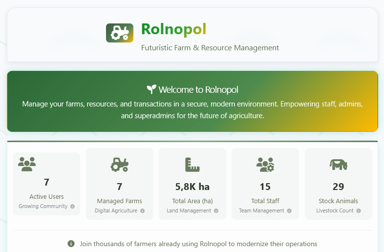
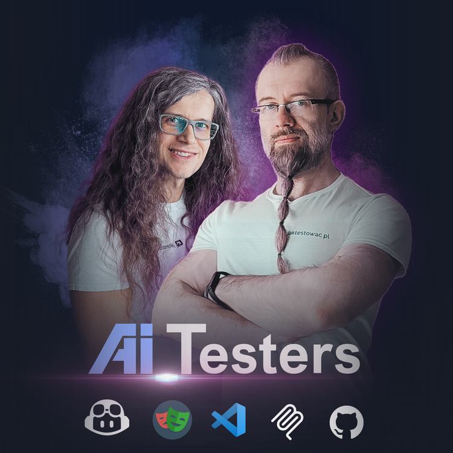

# 🌱 Rolnopol - Introduction

<p align="center">
  
</p>

> [!TIP]
> 💡 Choose your language:
>
> - 🇬🇧 [English](./README.md)
> - 🇵🇱 [Polski](./README.pl.md)

A realistic farming management application designed for **test automation practice**. Features a GUI, REST API, intentional bugs, and real-world scenarios for practicing automation and testing techniques.

- 📊 **Express.js API** with role-based access and rate limiting
- 🗄️ **JSON database** for easy test data control
- 🐛 **Intentional bugs & edge cases** for debugging practice
- 🧪 **Complex workflows** (financial, resource, authorization)

> [!NOTE]
> 🏗️ Curious how it all fits together? See **[ARCHITECTURE.md](./ARCHITECTURE.md)** for component, request-flow, auth, WebSocket, and Farm Defence diagrams (rendered with Mermaid).

# Table of Contents

- [Introduction](#introduction)
- [Features](#features)
- [Deployment](#deployment)
- [Contact & Support](#-contact--support)
- [Learning Resources](#-learning-resources)

## Quick Start

### Requirements

- **Node.js** v22+ ([download](https://nodejs.org/))
- **Git** ([download](https://git-scm.com/))

### Get Running in 3 Steps

```bash
git clone https://github.com/jaktestowac/rolnopol.git
cd rolnopol
npm i && npm run start
```

App is available at: **http://localhost:3000**

> 💡 **Startup Scripts:** For convenience, use `start.bat` (Windows), `./start.ps1` (PowerShell), `./start.sh` (Linux/macOS). See [START_SCRIPTS.md](./START_SCRIPTS.md) for details.

### Demo Credentials

For testing and demonstration purposes, the application includes several pre-configured demo users:

| Email                        | Password       |
| ---------------------------- | -------------- |
| `demo@example.com`           | `demo123`      |
| `test@example.com`           | `brownPass123` |
| `john.doe@example.com`       | `johndoe123`   |
| `jane.smith@example.com`     | `janesmith456` |
| `developer@example.com`      | `dev123456`    |
| `emptyuser@rolnopol.demo.pl` | `demoPass123`  |

**Note:** These are demo credentials for local development and testing only. Passwords are stored in plain text for easier testing and account management.

## Swagger UI

API documentation is available at: **http://localhost:3000/api-docs**

# Features

Rolnopol is not just a REST API to hit — it is a **full protocol and testing playground**. Almost every technique a test automation engineer needs to practice has a working target here, in one `npm i && npm run start`.

| Area                   | What you can practice                                                                                                                                | Where                                                                      |
| ---------------------- | ---------------------------------------------------------------------------------------------------------------------------------------------------- | -------------------------------------------------------------------------- |
| **REST API**           | 45 route modules, versioned surface (`/api/v1`, `/api/v2`), normalized response envelopes, pagination, filtering, id validation, rate limiting       | `/api-docs` (Swagger UI + OpenAPI schema)                                  |
| **GraphQL**            | Queries & mutations, custom scalars, depth and cost limits, SDL introspection over `GET`                                                             | `POST /api/graphql/crew` (Crew Office)                                     |
| **WebSockets**         | Three independent gateways with JWT-authenticated upgrades, heartbeats, payload caps and per-user rate limits                                        | `/api/v1/messages/ws`, `/api/v1/notifications/ws`, `/api/v1/greenhouse/ws` |
| **Server-Sent Events** | Long-lived streams, keep-alive heartbeats, reconnection, streamed AI responses                                                                       | Weather Live, Observatory, AgriAcademy exam clock, chatbot streaming       |
| **gRPC**               | 7 `.proto` services, unary + **server-streaming** RPCs, and bridges that re-stream gRPC to the browser as SSE/NDJSON                                 | Greenhouse, TaskLab, FarmStay, AgriAcademy (`npm run greenhouse`, …)       |
| **Microservices**      | Independent services on their own ports, gateway orchestration, health aggregation, graceful degradation, injected outages                           | FarmStay (5 services), AgriAcademy (6 services)                            |
| **Auth & security**    | User JWT (header/cookie), admin JWT, **personal API keys with scopes**, **2FA (TOTP + QR + backup codes)**, strong password policy, token revocation | `/api/v1/login`, account security page, `x-api-key`                        |
| **Webhooks**           | Outbound HTTP deliveries with attempt counts and delivery activity logs — plus a built-in sink to receive your own calls                             | Integrations page, `POST /api/v1/testing/webhooks/sink`                    |
| **Resilience / chaos** | Inject latency, error statuses, stateful failures, request mirroring and scoped traffic rules at runtime — no restart                                | Chaos Engine UI (`/chaos-engine.html`)                                     |
| **Feature flags**      | 47 runtime toggles gating pages, endpoints and whole modules — via UI, API, or a persistent `.ini` file                                              | `/feature-flags.html` (see below)                                          |
| **Observability**      | Prometheus metrics endpoint, in-app log viewer with runtime log-level switching, 404 statistics, service monitor                                     | `/backend.html`, `GET /api/v1/metrics`                                     |
| **Files & exports**    | PDF and CSV report generation, base64 image uploads, JSON data exports                                                                               | Financial, Weather, Profile avatar                                         |
| **AI / LLM**           | Chat assistants with mock, Gemini or OpenRouter providers, function/tool calling and token streaming                                                 | Porky assistant, alerts & docs AI widgets                                  |
| **Test isolation**     | Restore the whole JSON database to a known base state between runs                                                                                   | `POST /api/debug/database/restore-base`                                    |

**And plenty more to explore:** internal messenger, notification center (multi-channel pub/sub), marketplace and commodities trading, Farmlog blog space, interactive farm map, task manager, Pet Buddy, the Farm Defence game, Labyrinth, Operator Terminal, Observatory sky dome, a plugin runtime with request hooks — plus **intentional bugs, edge cases and hidden easter eggs** (yes, there is an HTTP 418) waiting to be found.

## Persistent Feature Flags (`feature-flags.ini`)

Feature flags are normally toggled at runtime on **http://localhost:3000/feature-flags.html**. To pin some of them permanently, copy the example file in the project root and edit it:

```bash
cp feature-flags.example.ini feature-flags.ini
```

```ini
[settings]
mode = enforce          ; enforce (default) | seed | off

[flags]
crewOfficeEnabled = true
messengerEnabled = false
```

- The file **outranks** `data/feature-flags.json`, so pinned flags survive restarts, "Reset to defaults", and a full database restore.
- In the default `enforce` mode those flags are read-only: the Feature Flags page shows them as 🔒 **Pinned** and the API answers `409` to a change. Use `mode = seed` to set values at startup but keep them editable afterwards, or `mode = off` to ignore the file.
- Accepted values: `true`/`false`, `1`/`0`, `on`/`off`, `yes`/`no` (case-insensitive).
- Active overrides and any problems with the file are logged as warnings at startup and shown on the Feature Flags page. **An invalid file never blocks startup** — the valid entries are applied and the rest is reported.
- The file is git-ignored and is **skipped entirely under `NODE_ENV=test`**, so it never affects test runs.

# Deployment

Instructions how to deploy presented service to various free hosting sites.

- [Deploy to Local](#deploy-on-local) (recommended)
- [Deploy using Docker image](#deploy-using-docker-image)

## Deploy on **Local**

Requirements:

- **node.js** [https://nodejs.org/](https://nodejs.org/) - installed in the system -
  - tested on node.js **v22** and **v24**
- **git** [https://git-scm.com/](https://git-scm.com/) - installed in the system

### First use

Steps:

1. Open the project root directory in cmd/terminal
1. Clone the repository using `git clone ...`
   - this is the **preferred way** to use this application
1. Run `npm i`
   - to install modules (don't use node.js global packages!)
1. Run `npm run start`
   - to start **🌱 Rolnopol**

The application will be available at `http://localhost:3000`

### Startup Scripts

For convenience, the project includes several scripts to start the application in different environments. These scripts automatically navigate to the project root and keep the terminal window open if the application stops or crashes.

- **Windows (CMD)**: Run `start.bat`
- **PowerShell**: Run `.\start.ps1`
- **Linux/macOS (Bash)**: Run `./start.sh`
- **Linux/macOS (Zsh)**: Run `./start.zsh`

For more details, see [START_SCRIPTS.md](./START_SCRIPTS.md).

### Update version

#### If You are using zip package

Steps:

1. Download zipped repository
1. Unzip and replace Your local instance of **🌱 Rolnopol**
1. Run `npm i` in root directory
   - to install new modules
1. Run `npm run start`
   - to start **🌱 Rolnopol**

#### If You are using cloned repository

Steps:

1. Open the project root directory in cmd/terminal
1. Pull latest changes using `git pull`
1. Run `npm i`
   - to install new modules
1. Run `npm run start`
   - to start **🌱 Rolnopol**

### Update version if You have any changes (e.g. in database)

One possibility is to reset all Your local changes and pull new version.Using this method **You will lose all Your local changes and data**!

Steps:

1. Open the project root directory in cmd/terminal
1. Reset local changes and pull latest changes using:
   ```
   git reset --hard HEAD
   git pull
   ```
1. Run `npm i`
   - to install new modules
1. Run `npm run start`
   - to start **🌱 Rolnopol**

## Deploy to **Render**

Render - a popular Heroku-like PaaS with a free tier and a “Deploy to Render” button for one-click deploys.

- Create free account on: https://dashboard.render.com/register
- After successful registration hit the button:

[](https://render.com/deploy?repo=https://github.com/jaktestowac/rolnopol)

- name your app
- hit `Apply`
- wait a while and click link to project `Rolnopol`
- click link to open app (under project name and repository)
- enjoy 750 free hours of service per month

When deploying the **🌱 Rolnopol** application on Render, please be aware that the application may not function fully due to the limitations of the Render platform. However, we are making every effort to ensure the highest possible compatibility.

## Deploy using Docker image

This method can be used:

- locally
- in CI/CD services (GitHub Actions, GitLab CI etc.)

### Prerequisites:

On local environment:

- latest Docker is installed

### Running

Just run following command to get latest image:

```
docker run -p 3000:3000 -d jaktestowac/rolnopol
```

or specific version:

```
docker run -p 3000:3000 -d jaktestowac/rolnopol:1.0.24
```

Application should be running under http://localhost:3000/

Images are available at:
[🐋 https://hub.docker.com/r/jaktestowac/rolnopol](https://hub.docker.com/r/jaktestowac/rolnopol)

## Happy Automation!

We hope you'll have a great time testing and automating this application!

The challenges and features included are designed to help you grow your testing skills while having fun.

If you have any ideas for improvements or encounter any issues, please don't hesitate to open an issue on our [GitHub repository](https://github.com/jaktestowac/rolnopol/issues).

Your feedback helps make **🌱 Rolnopol** better for everyone!

📢 Looking forward to your contributions and happy testing!

[🔝 Back to top](#introduction)

# 📞 Contact & Support

Feel free to reach out to us:

- 🌐 **Website**: [jaktestowac.pl](https://jaktestowac.pl)
- 💼 **LinkedIn**: [jaktestowac.pl](https://www.linkedin.com/company/jaktestowac/)
- 💬 **Discord**: [Polish Playwright Community](https://discord.gg/mUAqQ7FUaZ)
- 📧 **Support**: Check our website for contact details

---

# 📚 Learning Resources

We have gathered a collection of resources to help you learn and master Playwright, both in Polish and English. Whether you're a beginner or an advanced user, these resources will help you enhance your skills and knowledge.

## 🇵🇱 Polish Resources

- [JavaScript and TypeScript for Testers](https://jaktestowac.pl/js-ts/) - Comprehensive (13h+) course on JavaScript and TypeScript for testers, with practical examples and exercises
- [Professional Test Automation with Playwright](https://jaktestowac.pl/playwright/) - Comprehensive (100h+) course on Playwright, test automation, CI/CD and test architecture
- [Back-end Test Automation](https://jaktestowac.pl/api/) - Comprehensive (45h+) course on Back-end Test Automation with Postman, Mocha, Chai, and Supertest
- [Free Playwright Resources](https://jaktestowac.pl/darmowy-playwright/) - Comprehensive and Free Polish learning materials
- [Playwright Basics](https://www.youtube.com/playlist?list=PLfKhn9AcZ-cD2TCB__K7NP5XARaCzZYn7) - YouTube series (Polish)
- [Playwright Elements](https://www.youtube.com/playlist?list=PLfKhn9AcZ-cAcpd-XN4pKeo-l4YK35FDA) - Advanced concepts (Polish)
- [Playwright MCP](https://www.youtube.com/playlist?list=PLfKhn9AcZ-cCqD34AG5YRejujaBqCBgl4) - MCP course (Polish)
- [Discord Community](https://discord.gg/mUAqQ7FUaZ) - First Polish Playwright community!
- [Playwright Info](https://playwright.info/) - first and only Polish Playwright blog

## 🇬🇧 English Resources

- [VS Code Extensions](https://marketplace.visualstudio.com/publishers/jaktestowac-pl) - Our free Playwright plugins

### AI_Testers

<div align="center">
<a href="https://aitesters.pl">

</a>
</div>

Gain an edge by combining AI knowledge with the most popular tools in the IT market.  
We'll show you how to accelerate with AI and build a professional test automation framework. 😉

- [AI_Testers](https://aitesters.pl) - Main page about AI_Testers Program
- [AI_Testers LinkedIn](https://www.linkedin.com/company/aitesters) - Follow us on LinkedIn

---

**Happy testing and automation!** 🚀

**jaktestowac.pl Team** ❤️💚

_PS. For more resources and updates, follow us on our [website](https://jaktestowac.pl) and [GitHub](https://github.com/jaktestowac)._

---

_Built with ❤️💚 for the Playwright and test automation community_
