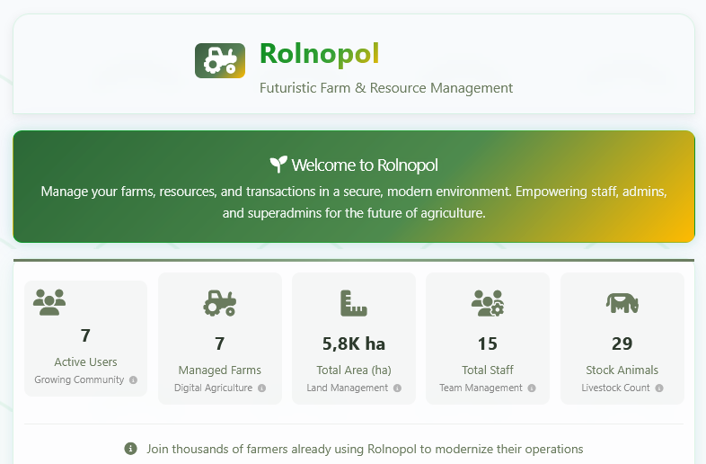

# 🌱 Rolnopol - Wprowadzenie

<p align="center">
  
</p>

> [!TIP]
> 💡 Wybierz język:
>
> - 🇬🇧 [English](./README.md)
> - 🇵🇱 [Polski](./README.pl.md)

Realistyczna aplikacja do zarządzania gospodarstwem rolnym zaprojektowana do **ćwiczenia automatyzacji testów**. Zawiera interfejs graficzny, REST API, specjalnie wprowadzone błędy i scenariusze do ćwiczenia automatyzacji i testowania.

- 📊 **Express.js API** z dostępem opartym na rolach i ograniczaniem szybkości
- 🗄️ **Baza danych JSON** do łatwej kontroli danych testowych
- 🐛 **Umyślne błędy i przypadki brzegowe** do ćwiczenia debugowania
- 🧪 **Złożone przepływy** (finansowe, zasobów, autoryzacji)

# Spis treści

- [Wprowadzenie](#wprowadzenie)
- [Funkcje](#funkcje)
- [Wdrażanie](#wdrażanie)
- [Kontakt i wsparcie](#-kontakt-i-wsparcie)
- [Zasoby edukacyjne](#-zasoby-edukacyjne)

## Szybki Start

### Wymagania

- **Node.js** v22+ ([pobierz](https://nodejs.org/))
- **Git** ([pobierz](https://git-scm.com/))

### Uruchomienie w 3 krokach

```bash
git clone https://github.com/jaktestowac/rolnopol.git
cd rolnopol
npm i && npm run start
```

Aplikacja jest dostępna pod adresem: **http://localhost:3000**

> 💡 **Skrypty startowe:** Do wygody możesz użyć `start.bat` (Windows), `./start.ps1` (PowerShell), `./start.sh` (Linux/macOS). Szczegóły w pliku [START_SCRIPTS.md](./START_SCRIPTS.md).

### Dane logowania do kont demonstracyjnych

Do celów testowych i demonstracyjnych aplikacja zawiera kilka wstępnie skonfigurowanych kont użytkowników:

| Email                        | Hasło          |
| ---------------------------- | -------------- |
| `demo@example.com`           | `demo123`      |
| `test@example.com`           | `brownPass123` |
| `john.doe@example.com`       | `johndoe123`   |
| `jane.smith@example.com`     | `janesmith456` |
| `developer@example.com`      | `dev123456`    |
| `emptyuser@rolnopol.demo.pl` | `demoPass123`  |

**Uwaga:** Są to dane demonstracyjne wyłącznie do lokalnego rozwoju i testowania. Hasła są przechowywane w formacie tekstowym (plain text) dla ułatwienia testów.

## Swagger UI

Dokumentacja API jest dostępna pod adresem: **http://localhost:3000/api-docs**

# Wdrażanie

Instrukcje wdrażania prezentowanej usługi na różnych bezpłatnych platformach hostingowych.

- [Wdrażanie lokalnie](#wdrażanie-lokalnie) (zalecane)
- [Wdrażanie przy użyciu obrazu Docker](#wdrażanie-przy-użyciu-obrazu-docker)

## Wdrażanie **lokalnie**

Wymagania:

- **node.js** [https://nodejs.org/](https://nodejs.org/) - zainstalowany w systemie
  - testowano na node.js **v22** i **v24**
- **git** [https://git-scm.com/](https://git-scm.com/) - zainstalowany w systemie

### Pierwsze użycie

Kroki:

1. Otwórz katalog główny projektu w cmd/terminalu
1. Sklonuj repozytorium używając `git clone ...`
   - to **preferowany sposób** używania tej aplikacji
1. Uruchom `npm i`
   - aby zainstalować moduły (nie używaj globalnych pakietów node.js!)
1. Uruchom `npm run start`
   - aby uruchomić **🌱 Rolnopol**

Aplikacja będzie dostępna pod adresem `http://localhost:3000`

### Skrypty startowe

Dla wygody projekt zawiera kilka skryptów do uruchamiania aplikacji w różnych środowiskach. Skrypty te automatycznie przechodzą do katalogu głównego projektu i utrzymują okno terminala otwarte w przypadku zatrzymania lub błędu aplikacji.

- **Windows (CMD)**: Uruchom `start.bat`
- **PowerShell**: Uruchom `.\start.ps1`
- **Linux/macOS (Bash)**: Uruchom `./start.sh`
- **Linux/macOS (Zsh)**: Uruchom `./start.zsh`

Więcej szczegółów znajdziesz w pliku [START_SCRIPTS.md](./START_SCRIPTS.md).

### Aktualizacja wersji

#### Jeśli używasz pakietu zip

Kroki:

1. Pobierz spakowane repozytorium
1. Rozpakuj i zastąp swoją lokalną instancję **🌱 Rolnopol**
1. Uruchom `npm i` w katalogu głównym
   - aby zainstalować nowe moduły
1. Uruchom `npm run start`
   - aby uruchomić **🌱 Rolnopol**

#### Jeśli używasz sklonowanego repozytorium

Kroki:

1. Otwórz katalog główny projektu w cmd/terminalu
1. Pociągnij najnowsze zmiany używając `git pull`
1. Uruchom `npm i`
   - aby zainstalować nowe moduły
1. Uruchom `npm run start`
   - aby uruchomić **🌱 Rolnopol**

### Aktualizacja wersji jeśli masz jakiekolwiek zmiany (np. w bazie danych)

Jedną z możliwości jest zresetowanie wszystkich lokalnych zmian i pociągnięcie nowej wersji. Używając tej metody **stracisz wszystkie swoje lokalne zmiany i dane**!

Kroki:

1. Otwórz katalog główny projektu w cmd/terminalu
1. Zresetuj lokalne zmiany i pociągnij najnowsze zmiany używając:
   ```
   git reset --hard HEAD
   git pull
   ```
1. Uruchom `npm i`
   - aby zainstalować nowe moduły
1. Uruchom `npm run start`
   - aby uruchomić **🌱 Rolnopol**

## Wdrażanie na **Render**

Render - popularna platforma PaaS podobna do Heroku z darmowym poziomem i przyciskiem "Deploy to Render" do jednoklikowych wdrożeń.

- Utwórz darmowe konto na: https://dashboard.render.com/register
- Po pomyślnej rejestracji naciśnij przycisk:

[](https://render.com/deploy?repo=https://github.com/jaktestowac/rolnopol)

- nazwij swoją aplikację
- naciśnij `Apply`
- poczekaj chwilę i kliknij link do projektu `Rolnopol`
- kliknij link, aby otworzyć aplikację (pod nazwą projektu i repozytorium)
- ciesz się 750 darmowymi godzinami usługi miesięcznie

Podczas wdrażania aplikacji **🌱 Rolnopol** na Render, należy pamiętać, że aplikacja może nie działać w pełni ze względu na ograniczenia platformy Render. Jednak dokładamy wszelkich starań, aby zapewnić najwyższą możliwą kompatybilność.

## Wdrażanie przy użyciu obrazu Docker

Ta metoda może być używana:

- lokalnie
- w usługach CI/CD (GitHub Actions, GitLab CI itp.)

### Wymagania wstępne:

W środowisku lokalnym:

- najnowszy Docker jest zainstalowany

### Uruchamianie

Po prostu uruchom następujące polecenie, aby uzyskać najnowszy obraz:

```
docker run -p 3000:3000 -d jaktestowac/rolnopol
```

lub konkretną wersję:

```
docker run -p 3000:3000 -d jaktestowac/rolnopol:1.0.24
```

Aplikacja powinna działać pod adresem http://localhost:3000/

Obrazy są dostępne pod adresem:
[🐋 https://hub.docker.com/r/jaktestowac/rolnopol](https://hub.docker.com/r/jaktestowac/rolnopol)

## Miłej automatyzacji!

Mamy nadzieję, że będziesz się dobrze bawić testując i automatyzując tę aplikację!

Włączone wyzwania i funkcje zostały zaprojektowane, aby pomóc Ci rozwijać umiejętności testowania, jednocześnie dobrze się bawiąc.

Jeśli masz pomysły na ulepszenia lub napotkasz jakiekolwiek problemy, nie wahaj się otworzyć zgłoszenia w naszym [repozytorium GitHub](https://github.com/jaktestowac/rolnopol/issues).

Twoja opinia pomaga uczynić **🌱 Rolnopol** lepszym dla wszystkich!

📢 Nie możemy się doczekać Twoich wkładów i miłej zabawy w testowaniu!

[🔝 Powrót na górę](#-rolnopol)

# 📞 Kontakt i wsparcie

Zapraszamy do kontaktu:

- 🌐 **Strona internetowa**: [jaktestowac.pl](https://jaktestowac.pl)
- 💼 **LinkedIn**: [jaktestowac.pl](https://www.linkedin.com/company/jaktestowac/)
- 💬 **Discord**: [Polish Playwright Community](https://discord.gg/mUAqQ7FUaZ)
- 📧 **Wsparcie**: Sprawdź naszą stronę internetową, aby uzyskać dane kontaktowe

---

# 📚 Zasoby edukacyjne

Zebraliśmy kolekcję zasobów, które pomogą Ci nauczyć się i opanować Playwright, zarówno w języku polskim, jak i angielskim. Niezależnie od tego, czy jesteś początkującym, czy zaawansowanym użytkownikiem, te zasoby pomogą Ci ulepszyć swoje umiejętności i wiedzę.

## 🇵🇱 Polskie zasoby

- [JavaScript i TypeScript dla testerów](https://jaktestowac.pl/js-ts/) - Kompleksowy (13h+) kurs JavaScript i TypeScript dla testerów, z praktycznymi przykładami i ćwiczeniami
- [Profesjonalna automatyzacja testów z Playwright](https://jaktestowac.pl/playwright/) - Kompleksowy (100h+) kurs Playwright, automatyzacji testów, CI/CD i architektury testów
- [Automatyzacja testów backend](https://jaktestowac.pl/api/) - Kompleksowy (45h+) kurs automatyzacji testów backend z Postman, Mocha, Chai i Supertest
- [Darmowe zasoby Playwright](https://jaktestowac.pl/darmowy-playwright/) - Kompleksowe i darmowe materiały edukacyjne w języku polskim
- [Podstawy Playwright](https://www.youtube.com/playlist?list=PLfKhn9AcZ-cD2TCB__K7NP5XARaCzZYn7) - Seria na YouTube (po polsku)
- [Elementy Playwright](https://www.youtube.com/playlist?list=PLfKhn9AcZ-cAcpd-XN4pKeo-l4YK35FDA) - Zaawansowane koncepcje (po polsku)
- [Playwright MCP](https://www.youtube.com/playlist?list=PLfKhn9AcZ-cCqD34AG5YRejujaBqCBgl4) - Kurs MCP (po polsku)
- [Społeczność Discord](https://discord.gg/mUAqQ7FUaZ) - Pierwsza polska społeczność Playwright!
- [Playwright Info](https://playwright.info/) - pierwszy i jedyny polski blog o Playwright

## 🇬🇧 Zasoby angielskie

- [Rozszerzenia VS Code](https://marketplace.visualstudio.com/publishers/jaktestowac-pl) - Nasze darmowe wtyczki Playwright

### AI_Testers

<div align="center">
<a href="https://aitesters.pl">

</a>
</div>

Zdobądź przewagę łącząc wiedzę AI z najpopularniejszymi narzędziami na rynku IT.
Pokażemy Ci jak przyspieszyć z AI i zbudować profesjonalny framework do automatyzacji testów 😉

- [AI_Testers](https://aitesters.pl) - Strona o Programie AI_Testers
- [AI_Testers LinkedIn](https://www.linkedin.com/company/aitesters) - Nasz profil na LinkedIn

---

**Miłej zabawy w testowaniu i automatyzacji!** 🚀

**Zespół jaktestowac.pl** ❤️💚

_PS. Aby uzyskać więcej zasobów i aktualizacji, śledź nas na naszej [stronie internetowej](https://jaktestowac.pl) i [GitHub](https://github.com/jaktestowac)._

---

_Zbudowane z ❤️💚 dla społeczności Playwright i automatyzacji testów_
