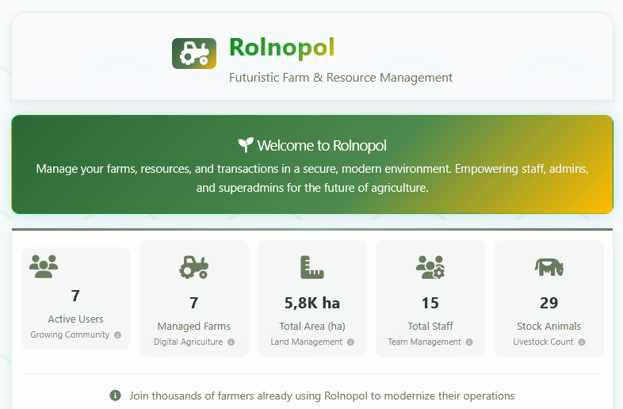

# Wprowadzenie

<p align="center">
  
</p>

> [!TIP]
> 💡 Wybierz język:
>
> - 🇬🇧 [English](./README.md)
> - 🇵🇱 [Polski](./README.pl.md)

Ta aplikacja (nazywana **🌱 Rolnopol**) została przygotowana i opracowana **wyłącznie w celach testowych**. Zapewnia:

- Graficzny interfejs użytkownika (GUI)
- REST API
- Zintegrowaną dokumentację Swagger

Aplikacja zawiera funkcje takie jak logikę biznesową, autoryzację, zarządzanie zasobami, statystyki i wykresy. Jest celowo zaprojektowana z **umyślnymi błędami**🐛 i wyzwaniami, aby symulować złożoności rzeczywistych projektów.

**🌱 Rolnopol** jest idealny do nauki automatyzacji testów, doskonalenia technik QA oraz ćwiczenia scenariuszy spotykanych w różnorodnych **rzeczywistych projektach** z różnorodnymi rzeczywistymi scenariuszami.

# Spis treści

- [Wprowadzenie](#wprowadzenie)
- [Funkcje](#funkcje)
- [Wdrażanie](#wdrażanie)
- [Kontakt i wsparcie](#kontakt-i-wsparcie)

# Funkcje

🌱 **Rolnopol** to realistyczna aplikacja do zarządzania gospodarstwem rolnym, zbudowana specjalnie do ćwiczenia automatyzacji testów w rzeczywistej domenie. Symuluje złożone procesy biznesowe, jednocześnie zapewniając architekturę doskonałą do testowania różnorodnych scenariuszy automatyzacji.

## 🏗️ Architektura

- **Framework Express.js** z modularnym oprogramowaniem pośredniczącym (uwierzytelnianie, ograniczanie szybkości, logowanie)
- **Wersjonowane REST API** (v1/v2) do testowania ewolucji API i kompatybilności
- **Baza danych plików JSON** do łatwej manipulacji danymi i kontroli stanu testów
- **Warstwowa architektura**: routes → controllers → services → data access

## 🧪 Scenariusze testowania i wyzwania

- **Uwierzytelnianie i autoryzacja**: tokeny JWT, dostęp oparty na rolach, zarządzanie sesjami
- **Testowanie API**: operacje CRUD, walidacja danych, obsługa błędów, ograniczanie szybkości
- **Logika biznesowa**: transakcje finansowe, procesy rynku, zarządzanie zasobami
- **UI i integracja**: interfejsy webowe, aktualizacje w czasie rzeczywistym, kompleksowe procesy

## 🎯 Specyficzne dla domeny ćwiczenia testowania

- **Biznes rolniczy**: zarządzanie gospodarstwem, operacje hodowlane, koordynacja personelu
- **Operacje finansowe**: bankowość cyfrowa, systemy płatności, raportowanie finansowe
- **Przetwarzanie danych**: integracja pogody, metryki wydajności, analityka

## 🎮 Nauka poprzez wyzwania

- **Umyślne błędy** do ćwiczenia debugowania i obsługi błędów
- **Przypadki brzegowe** wymagające dokładnego pokrycia testami
- **Progresywna trudność** od podstawowych operacji CRUD do złożonych procesów
- **Scenariusze rzeczywiste** symulujące zachowanie aplikacji produkcyjnych

Ta architektura zapewnia doskonałe środowisko do ćwiczenia nowoczesnych technik automatyzacji testów przy pracy z realistycznymi domenami biznesowymi i złożonymi interakcjami systemów.

# Wdrażanie

Instrukcje wdrażania prezentowanej usługi na różnych bezpłatnych platformach hostingowych.

- [Wdrażanie lokalnie](#wdrażanie-lokalnie) (zalecane)
- [Wdrażanie przy użyciu obrazu Docker](#wdrażanie-przy-użyciu-obrazu-docker)

## Wdrażanie **lokalnie**

Wymagania:

- **node.js** [https://nodejs.org/](https://nodejs.org/) - (**v22** i wyższe)
- **git** [https://git-scm.com/](https://git-scm.com/)

### Pierwsze użycie

Kroki:

1. Otwórz katalog główny projektu w cmd/terminalu
1. Sklonuj repozytorium używając `git clone ...`
   - to **preferowany sposób** używania tej aplikacji
1. Uruchom `npm i`
   - aby zainstalować moduły (nie używaj globalnych pakietów node.js!)
1. Uruchom `npm run start`
   - aby uruchomić **🌱 Rolnopol**

Aplikacja będzie dostępna pod adresem `http://localhost:3000`

### Aktualizacja wersji

#### Jeśli używasz pakietu zip

Kroki:

1. Pobierz spakowane repozytorium
1. Rozpakuj i zastąp swoją lokalną instancję **🌱 Rolnopol**
1. Uruchom `npm i` w katalogu głównym
   - aby zainstalować nowe moduły
1. Uruchom `npm run start`
   - aby uruchomić **🌱 Rolnopol**

#### Jeśli używasz sklonowanego repozytorium

Kroki:

1. Otwórz katalog główny projektu w cmd/terminalu
1. Pociągnij najnowsze zmiany używając `git pull`
1. Uruchom `npm i`
   - aby zainstalować nowe moduły
1. Uruchom `npm run start`
   - aby uruchomić **🌱 Rolnopol**

### Aktualizacja wersji jeśli masz jakiekolwiek zmiany (np. w bazie danych)

Jedną z możliwości jest zresetowanie wszystkich lokalnych zmian i pociągnięcie nowej wersji. Używając tej metody **stracisz wszystkie swoje lokalne zmiany i dane**!

Kroki:

1. Otwórz katalog główny projektu w cmd/terminalu
1. Zresetuj lokalne zmiany i pociągnij najnowsze zmiany używając:
   ```
   git reset --hard HEAD
   git pull
   ```
1. Uruchom `npm i`
   - aby zainstalować nowe moduły
1. Uruchom `npm run start`
   - aby uruchomić **🌱 Rolnopol**

## Wdrażanie na **Render**

Render - popularna platforma PaaS podobna do Heroku z darmowym poziomem i przyciskiem "Deploy to Render" do jednoklikowych wdrożeń.

- Utwórz darmowe konto na: https://dashboard.render.com/register
- Po pomyślnej rejestracji naciśnij przycisk:

[](https://render.com/deploy?repo=https://github.com/jaktestowac/rolnopol)

- nazwij swoją aplikację
- naciśnij `Apply`
- poczekaj chwilę i kliknij link do projektu `Rolnopol`
- kliknij link, aby otworzyć aplikację (pod nazwą projektu i repozytorium)
- ciesz się 750 darmowymi godzinami usługi miesięcznie

Podczas wdrażania aplikacji **🌱 Rolnopol** na Render, należy pamiętać, że aplikacja może nie działać w pełni ze względu na ograniczenia platformy Render. Jednak dokładamy wszelkich starań, aby zapewnić najwyższą możliwą kompatybilność.

## Wdrażanie przy użyciu obrazu Docker

Ta metoda może być używana:

- lokalnie
- w usługach CI/CD (GitHub Actions, GitLab CI itp.)

### Wymagania wstępne:

W środowisku lokalnym:

- najnowszy Docker jest zainstalowany

### Uruchamianie

Po prostu uruchom następujące polecenie, aby uzyskać najnowszy obraz:

```
docker run -p 3000:3000 -d jaktestowac/rolnopol
```

lub konkretną wersję:

```
docker run -p 3000:3000 -d jaktestowac/rolnopol:1.0.24
```

Aplikacja powinna działać pod adresem http://localhost:3000/

Obrazy są dostępne pod adresem:
[🐋 https://hub.docker.com/r/jaktestowac/rolnopol](https://hub.docker.com/r/jaktestowac/rolnopol)

## Miłej automatyzacji!

Mamy nadzieję, że będziesz się dobrze bawić testując i automatyzując tę aplikację!

Włączone wyzwania i funkcje zostały zaprojektowane, aby pomóc Ci rozwijać umiejętności testowania, jednocześnie dobrze się bawiąc.

Jeśli masz pomysły na ulepszenia lub napotkasz jakiekolwiek problemy, nie wahaj się otworzyć zgłoszenia w naszym [repozytorium GitHub](https://github.com/jaktestowac/rolnopol/issues).

Twoja opinia pomaga uczynić **🌱 Rolnopol** lepszym dla wszystkich!

📢 Nie możemy się doczekać Twoich wkładów i miłej zabawy w testowaniu!

[🔝 Powrót na górę](#wprowadzenie)

# 📞 Kontakt i wsparcie

Zapraszamy do kontaktu:

- 🌐 **Strona internetowa**: [jaktestowac.pl](https://jaktestowac.pl)
- 💼 **LinkedIn**: [jaktestowac.pl](https://www.linkedin.com/company/jaktestowac/)
- 💬 **Discord**: [Polish Playwright Community](https://discord.gg/mUAqQ7FUaZ)
- 📧 **Wsparcie**: Sprawdź naszą stronę internetową, aby uzyskać dane kontaktowe

---

# 📚 Zasoby edukacyjne

Zebraliśmy kolekcję zasobów, które pomogą Ci nauczyć się i opanować Playwright, zarówno w języku polskim, jak i angielskim. Niezależnie od tego, czy jesteś początkującym, czy zaawansowanym użytkownikiem, te zasoby pomogą Ci ulepszyć swoje umiejętności i wiedzę.

## 🇵🇱 Polskie zasoby

- [JavaScript i TypeScript dla testerów](https://jaktestowac.pl/js-ts/) - Kompleksowy (13h+) kurs JavaScript i TypeScript dla testerów, z praktycznymi przykładami i ćwiczeniami
- [Profesjonalna automatyzacja testów z Playwright](https://jaktestowac.pl/playwright/) - Kompleksowy (100h+) kurs Playwright, automatyzacji testów, CI/CD i architektury testów
- [Automatyzacja testów backend](https://jaktestowac.pl/api/) - Kompleksowy (45h+) kurs automatyzacji testów backend z Postman, Mocha, Chai i Supertest
- [Darmowe zasoby Playwright](https://jaktestowac.pl/darmowy-playwright/) - Kompleksowe i darmowe materiały edukacyjne w języku polskim
- [Podstawy Playwright](https://www.youtube.com/playlist?list=PLfKhn9AcZ-cD2TCB__K7NP5XARaCzZYn7) - Seria na YouTube (po polsku)
- [Elementy Playwright](https://www.youtube.com/playlist?list=PLfKhn9AcZ-cAcpd-XN4pKeo-l4YK35FDA) - Zaawansowane koncepcje (po polsku)
- [Playwright MCP](https://www.youtube.com/playlist?list=PLfKhn9AcZ-cCqD34AG5YRejujaBqCBgl4) - Kurs MCP (po polsku)
- [Społeczność Discord](https://discord.gg/mUAqQ7FUaZ) - Pierwsza polska społeczność Playwright!
- [Playwright Info](https://playwright.info/) - pierwszy i jedyny polski blog o Playwright

## 🇬🇧 Zasoby angielskie

- [Rozszerzenia VS Code](https://marketplace.visualstudio.com/publishers/jaktestowac-pl) - Nasze darmowe wtyczki Playwright

### AI_Testers

<div align="center">
<a href="https://aitesters.pl">

</a>
</div>

Zdobądź przewagę łącząc wiedzę AI z najpopularniejszymi narzędziami na rynku IT.
Pokażemy Ci jak przyspieszyć z AI i zbudować profesjonalny framework do automatyzacji testów 😉

- [AI_Testers](https://aitesters.pl) - Strona o Programie AI_Testers
- [AI_Testers LinkedIn](https://www.linkedin.com/company/aitesters) - Nasz profil na LinkedIn

---

**Miłej zabawy w testowaniu i automatyzacji!** 🚀

**Zespół jaktestowac.pl** ❤️💚

_PS. Aby uzyskać więcej zasobów i aktualizacji, śledź nas na naszej [stronie internetowej](https://jaktestowac.pl) i [GitHub](https://github.com/jaktestowac)._

---

_Zbudowane z ❤️💚 dla społeczności Playwright i automatyzacji testów_
