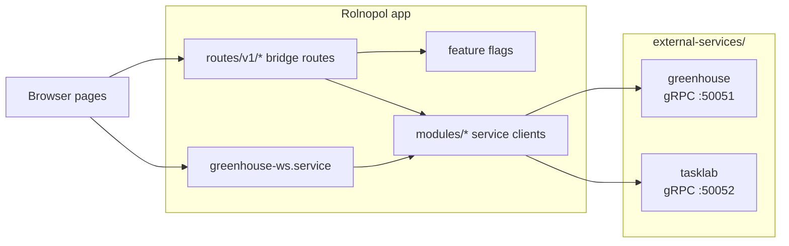
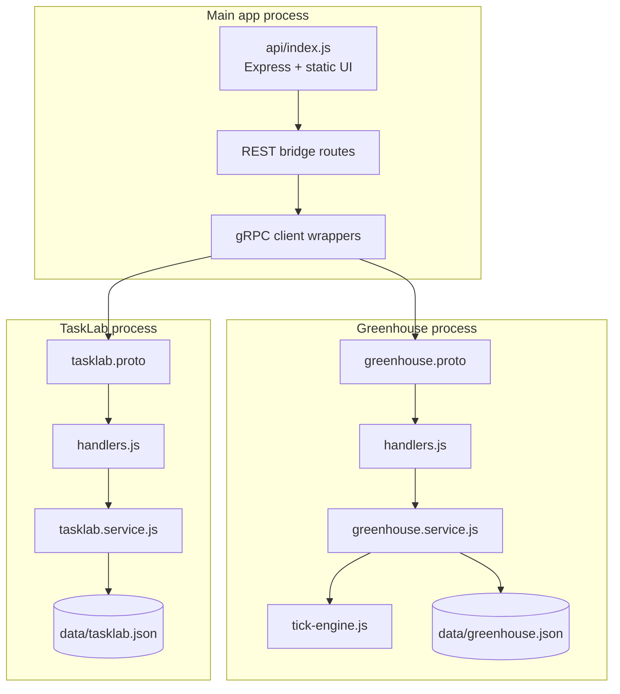

# External Services

This directory is the home for service-owned code that runs outside the main
Rolnopol Express app. Each service keeps its own contract, runtime config, server
entrypoint, CLI/demo clients, data fixtures, and service README under its own
folder.

The app should stay thin: it can call these services through small clients in
`modules/`, expose bridge routes in `routes/v1/`, and gate UI pages with feature
flags, but service domain logic belongs here.

## Service Map



## Services

| Service    | Status      | Runtime       | Responsibility                                               | Docs                                           |
| ---------- | ----------- | ------------- | ------------------------------------------------------------ | ---------------------------------------------- |
| Greenhouse | Implemented | gRPC `:50051` | Plant slots, crop catalog, growth simulation, harvest count  | [`greenhouse/README.md`](greenhouse/README.md) |
| TaskLab    | Implemented | gRPC `:50052` | Per-user task list, task statuses, archive/restore lifecycle | [`tasklab/README.md`](tasklab/README.md)       |

## Implemented Layout

```text
external-services/
├── greenhouse/
│   ├── greenhouse.proto
│   ├── greenhouse-config.js
│   ├── client-health.js
│   ├── client-plant.js
│   ├── greenhouse-server/
│   └── README.md
├── tasklab/
│   ├── tasklab.proto
│   ├── tasklab-config.js
│   ├── client-tasklab.js
│   ├── tasklab-server/
│   └── README.md
```

## Runtime Boundaries



The `.proto` files are service-owned and loaded at runtime by both sides: the
service process and the Rolnopol app client wrapper. There is no generated client
code checked in.

## Run

```bash
npm run greenhouse
npm run greenhouse:health
npm run greenhouse:plant

npm run tasklab
npm run tasklab:demo
```

## Test

```bash
npm run greenhouse:test
npm run tasklab:test
```

Additional integration coverage that touches service config/import surfaces:

```bash
npx vitest run tests/services-monitor.test.js tests/tasklab-client.test.js tests/tasklab-client-deadline.test.js
```

## App Integration

- App-side gRPC clients live in [`modules/greenhouse`](../modules/greenhouse) and [`modules/tasklab`](../modules/tasklab).
- Browser REST bridges live in [`routes/v1/greenhouse.route.js`](../routes/v1/greenhouse.route.js) and [`routes/v1/tasklab.route.js`](../routes/v1/tasklab.route.js).
- Greenhouse live updates are bridged through [`services/greenhouse-ws.service.js`](../services/greenhouse-ws.service.js).

## Service Details

Greenhouse owns a three-slot grow-a-plant simulation. It accepts logged-in user
identities or anonymous demo identities, persists user state, keeps demo state
in memory, and exposes both unary RPCs and a server-streaming `WatchGreenhouses`
feed.

TaskLab owns a private task list per logged-in user. It exposes unary RPCs for
status catalog lookup, listing/filtering tasks, creating tasks, moving statuses,
archiving, and restoring. It is intentionally login-only.

Farm Stay and Agri Academy are PRD-stage service families. Their PRDs describe
multi-service ecosystems that should follow the same ownership rule: contracts,
server code, demo clients, and service data stay under their service family.

## Ownership Rules

- Keep service contracts and service-local config inside the service folder.
- Keep domain logic inside the service folder, not in the main app.
- Use root `data/*.json` only for legacy implemented services that already share the repo JSON database layer.
- New service families should keep their runtime data under their own service directories unless a PRD explicitly says otherwise.
- Prefer narrow app bridge modules over direct imports from routes/controllers into service internals.
