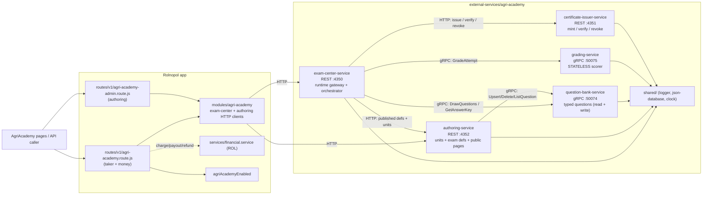
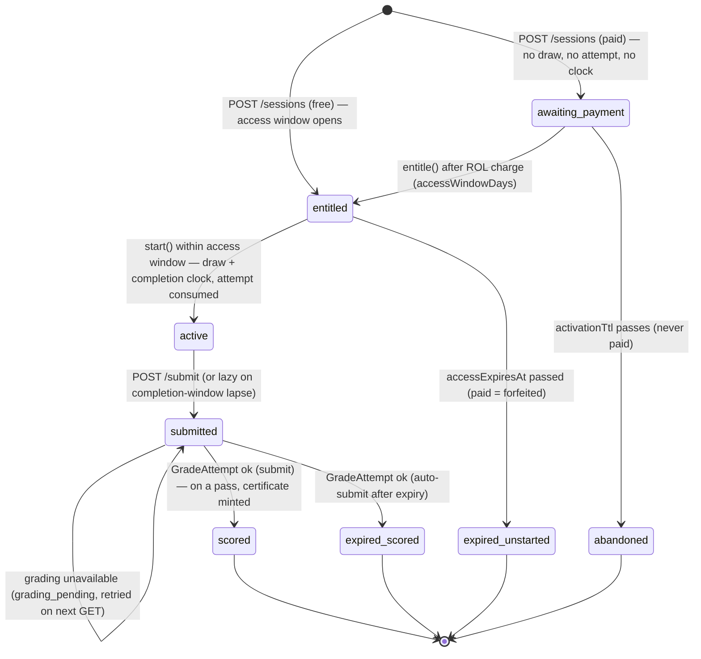

# AgriAcademy — Certification Exams (external microservice ecosystem)

AgriAcademy is a timed **certification-exam** platform for farm skills ("Pesticide
Handling Basics", "Tractor Safety"), implemented as a **self-contained ecosystem of
five standalone services** that is **independent of Rolnopol**. Certification units
author typed multiple-choice exams; any user takes them. A paid exam is settled in
ROL **before** the attempt begins (money lives only in the Rolnopol bridge, never in
the ecosystem — the [farm-stay](../farm-stay/README.md) cash-flow model).

Unlike an all-gRPC or all-REST ecosystem, AgriAcademy **deliberately mixes
protocols**: the two gateways and the certificate issuer speak REST; the question
bank and grader speak gRPC — so one ecosystem exercises both bridge styles.

> The authoritative design (rationale, state machines, degradation matrix, open
> questions) lives in [`PRD.md`](./PRD.md). This README is the operator's guide.

---

## Architecture



**Two orchestrators, three leaves.** Only `exam-center` and `authoring` hold clients.
`question-bank`, `grading`, and `certificate-issuer` are leaves that dial no one. The
question bank is dialed by **both** gateways (reads from the exam center, writes from
authoring). Rolnopol dials **only the two gateways**, never a leaf.

---

## Services

| Service                      | Runtime |    Port | Owns data                 | Responsibility                                                                                           |
| ---------------------------- | ------- | ------: | ------------------------- | -------------------------------------------------------------------------------------------------------- |
| `exam-center-service`        | REST    |  `4350` | `data/exam-center.json`   | Sessions, two server-side clocks, attempt limits/locks; orchestrates draw → grade → issue.               |
| `certificate-issuer-service` | REST    |  `4351` | `data/certificates.json`  | Mint (sequential `AA-<year>-<000123>`, idempotent per session) / verify / revoke. Always issues `valid`. |
| `authoring-service`          | REST    |  `4352` | `data/authoring.json`     | Certification units, exam definitions, typed-question authoring, public unit pages + published surface.  |
| `question-bank-service`      | gRPC    | `50074` | `data/question-bank.json` | Typed question pools; seeded draw + option shuffle, answer keys, write RPCs.                             |
| `grading-service`            | gRPC    | `50075` | _none (stateless)_        | Per-type scoring (`single` exact, `multi` partial credit) → score % + pass verdict.                      |

All ports, targets, and DB paths are env-overridable (`EXAM_CENTER_PORT`,
`AUTHORING_PORT`, `CERTIFICATE_ISSUER_PORT`, `QUESTION_BANK_GRPC_PORT`,
`GRADING_GRPC_PORT`, the matching `*_TARGET`s, and `*_DB_PATH`s). Use `0` for an
ephemeral gRPC port in tests. The injectable clock reads `AGRI_ACADEMY_TIME_OFFSET_MS`
(test-mode only) so deadline tests cross clocks without sleeping.

---

## Running the ecosystem

```bash
npm run academy            # supervisor: starts ALL five (leaves + issuer + authoring, then exam center)
                           # Ctrl-C stops the whole ecosystem cleanly

# …or run any service standalone:
npm run academy:exam-center
npm run academy:authoring
npm run academy:questions
npm run academy:grading
npm run academy:certs
```

Every stateful service **self-seeds** on first boot: authoring ships a demo unit +
two published exams (`pesticide-basics`, `tractor-safety`), the question bank ships
16 real questions per pool. Delete a `data/*.json` file to re-seed it.

### Aggregate health

```
GET http://localhost:4350/health/all
→ { overall: "SERVING" | "DEGRADED" | "DOWN",
    services: [ exam-center, authoring, question-bank, grading, certificate-issuer ] }
```

An unreachable service is reported `UNREACHABLE` (never a thrown error); the report
always lists all five. In Rolnopol: `GET /api/v1/agri-academy/health` (200 all-up,
503 when any is down).

### Demos (run the ecosystem first)

```bash
npm run academy:demo:author   # authoring plane: register unit → author exam → add questions → publish
npm run academy:demo          # full happy path: author a throwaway exam → take → submit → pass → certificate
```

---

## Testing

```bash
npm run academy:test    # all AgriAcademy suites (unit + integration)
```

Per-repo convention: the **full** vitest run is flaky, so verify a failing test **in
isolation**. The suites use isolated temp DBs, ephemeral/fixed ports per pid,
`AGRI_ACADEMY_LOG=silent`, deterministic seeds, and the injectable clock (no
`setTimeout`-based waiting).

| Suite                                 | Covers                                                                                   |
| ------------------------------------- | ---------------------------------------------------------------------------------------- |
| `agri-academy.question-bank.test.js`  | seeded draw determinism, option shuffle, exhaustion, key fetch, write RPCs, unknown-type |
| `agri-academy.question-types.test.js` | authoring validation registry + extensibility seam                                       |
| `agri-academy.grading.test.js`        | per-type scoring math, pass-threshold boundary, extensibility seam                       |
| `agri-academy.certificates.test.js`   | mint / sequential numbering / idempotent per session / verify states / revoke            |
| `agri-academy.authoring.test.js`      | unit CRUD, ownership `403`, publish validation, public/published surfaces                |
| `agri-academy.exam-center.test.js`    | session lifecycle, two clocks, attempt lock, grading_pending, cert issuance, health/all  |
| `agri-academy-rest.test.js`           | both bridges end to end (author → publish → take → pass → certificate)                   |
| `agri-academy-payment.test.js`        | pay-before-exam: charge/payout → entitle; `402`; refund+clawback; reconcile              |
| `agri-academy-health.test.js`         | `/health/all` SERVING → DEGRADED when one service is killed                              |
| `agri-academy-pages-gating.test.js`   | HTML pages 404 when the flag is off; `/agri-academy` → units directory                   |
| `agri-academy-independence.test.js`   | no service imports from Rolnopol (incl. `financial.service`); no new deps                |

---

## Domain model

```
Unit        { unitId, ownerUserId, name, description, contactEmail, payoutUserId, createdAt, status,
              tags: string[], color: "#rrggbb", icon: <predefined Font Awesome key> }
Exam        { id, ownerUnitId, title, description, questionCount, durationSec, accessWindowDays, passPct,
              attemptsAllowed, certValidMonths, certTemplate: <one of 10 predefined ids>,
              pricing: { mode: free|paid, priceRol }, status: draft|published }
Question    { id, type: "single"|"multi", text, options[], correct[], weight }
Session     { id, userId, examId, seed, questions[], answers{qId→answer},
              snapshot: { durationSec, accessWindowDays, passPct, attemptsAllowed, certValidMonths, pricing,
                          ownerUnitId, payoutUserId },
              state: awaiting_payment | entitled | active | submitted | scored | expired_scored
                     | expired_unstarted | abandoned,
              activationExpiresAt?, entitledAt?, accessExpiresAt?, startedAt?, expiresAt?,
              submittedAt?, finalReason?, payment?, result? }
Result      { scorePct, passed, perQuestion[], finalizedAt, certNo?, certificateStatus? }
Certificate { certNo, examId, examTitle, ownerUnitId, holder, sessionId, scorePct, issuedAt, expiresAt,
              revoked, revokedReason }
```

### Question types (extensible)

| type     | authoring validation                                     | grading                                                                    |
| -------- | -------------------------------------------------------- | -------------------------------------------------------------------------- |
| `single` | exactly **one** `correct`; answer is one option id       | full `weight` iff the single selected id equals the key, else 0            |
| `multi`  | **one or more** `correct`; answer is a set of option ids | partial credit `(correctSelected − wrongSelected)` floored at 0, ×`weight` |

Adding a type = one validation strategy (authoring `question-types/`) + one scoring
strategy (grading `question-types/`); no proto change, no DB migration. Unknown types
are rejected at authoring **and** at the bank.

### Session state machine



---

## The two clocks & attempt policy

- **Access window** (`accessWindowDays`, unit-set): after paying/enrolling, how long
  the taker has to `start`. Touching an `entitled` session past `accessExpiresAt` →
  `expired_unstarted` (no attempt consumed; a paid entitlement is forfeited — no refund).
- **Completion window** (`durationSec`, unit-set): the timed test, begun **only at
  `start`** (never at payment). Access past `expiresAt` lazily finalizes from saved
  answers; a `PUT` after it → `410`.
- **Attempts** (`attemptsAllowed`, default 3): consumed at `start`. A failed attempt
  that exhausts the allowance locks the exam for a cooldown (`COOLDOWN_MS`, default
  10 min); starting while locked → `403 EXAM_LOCKED`; the cooldown lapsing resets the count.

Both clocks are server-authoritative; the UI countdown is cosmetic.

---

## Money (Rolnopol bridge only)

Money never lives in the ecosystem — it stores only price metadata + a paid flag on
the attempt. A **paid** exam is settled in the Rolnopol taker bridge:

1. `POST /sessions` → exam center returns `awaiting_payment` + `{ priceRol, payoutUserId }`.
2. Bridge charges the taker (`agri-attempt-<sid>`) and pays the unit (`agri-payout-<sid>`).
3. Bridge calls internal `entitle` → access window opens.

Insufficient funds → `402` (session stays `awaiting_payment`, no attempt). A charge
that succeeds but whose `entitle` fails → refund taker + clawback unit
(`agri-refund-<sid>`) → `502`. Every ROL move is keyed by a stable `referenceId`;
`POST /sessions` honours `Idempotency-Key`; `POST /reconcile` repairs stuck
charges/payouts/refunds. Free exams move no money.

---

## Independence & feature flag

- **No file under `external-services/agri-academy/` imports from Rolnopol** (enforced
  by `agri-academy-independence.test.js`, including no `financial.service`). Logger,
  DB, and clock are copied into `shared/` and owned by the ecosystem.
- The whole feature is behind `agriAcademyEnabled` (default off). Both Rolnopol
  bridges are defensively loaded — the app boots even if either import fails — and the
  HTML pages are server-gated by the same flag.

## Rolnopol pages

Reached from the navbar (when the flag is on): **`/agri-academy-units.html`** (the main
directory + entry point), **`/agri-academy.html`** (taker), **`/agri-academy-unit.html`**
(public unit profile), **`/agri-academy-authoring.html`** (unit console). All share the
site header re-themed to the AgriAcademy green palette (`css/pages/agri-academy.css`).
