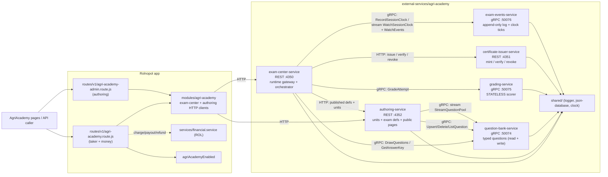
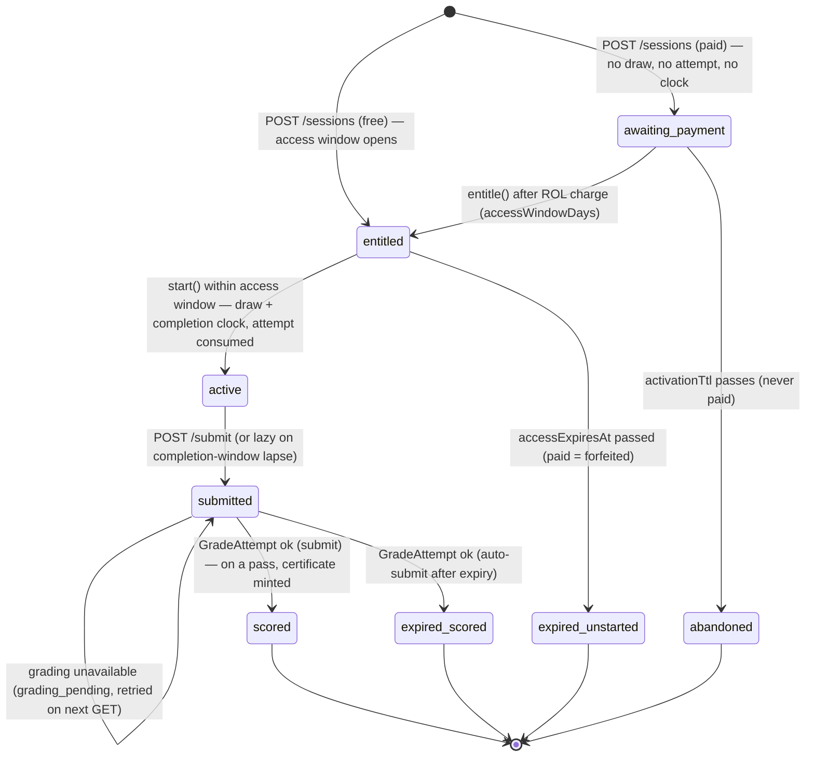

# AgriAcademy — Certification Exams (external microservice ecosystem)

AgriAcademy is a timed **certification-exam** platform for farm skills ("Pesticide
Handling Basics", "Tractor Safety"), implemented as a **self-contained ecosystem of
five standalone services** that is **independent of Rolnopol**. Certification units
author typed multiple-choice exams; any user takes them. A paid exam is settled in
ROL **before** the attempt begins (money lives only in the Rolnopol bridge, never in
the ecosystem — the [farm-stay](../farm-stay/README.md) cash-flow model).

Unlike an all-gRPC or all-REST ecosystem, AgriAcademy **deliberately mixes
protocols**: the two gateways and the certificate issuer speak REST; the question
bank and grader speak gRPC — so one ecosystem exercises both bridge styles.

> The authoritative design (rationale, state machines, degradation matrix, open
> questions) lives in [`PRD.md`](./PRD.md). This README is the operator's guide.

---

## Architecture


```mermaid
flowchart LR
    Browser["AgriAcademy pages / API caller"]

    subgraph App["Rolnopol app"]
        Taker["routes/v1/agri-academy.route.js<br/>(taker + money)"]
        Admin["routes/v1/agri-academy-admin.route.js<br/>(authoring)"]
        Client["modules/agri-academy<br/>exam-center + authoring HTTP clients"]
        Fin["services/financial.service (ROL)"]
        Flag["agriAcademyEnabled"]
    end

    subgraph AA["external-services/agri-academy"]
        EXC["exam-center-service<br/>REST :4350<br/>runtime gateway + orchestrator"]
        AUT["authoring-service<br/>REST :4352<br/>units + exam defs + public pages"]
        QBK["question-bank-service<br/>gRPC :50074<br/>typed questions (read + write)"]
        GRD["grading-service<br/>gRPC :50075<br/>STATELESS scorer"]
        CRT["certificate-issuer-service<br/>REST :4351<br/>mint / verify / revoke"]
        EVT["exam-events-service<br/>gRPC :50076<br/>append-only log + clock ticks"]
        Shared["shared/ (logger, json-database, clock)"]
    end

    Browser --> Taker
    Browser --> Admin
    Taker --> Flag
    Taker -. charge/payout/refund .-> Fin
    Taker --> Client
    Admin --> Client
    Client -- HTTP --> EXC
    Client -- HTTP --> AUT
    EXC -- "HTTP: published defs + units" --> AUT
    EXC -- "gRPC: DrawQuestions / GetAnswerKey" --> QBK
    EXC -- "gRPC: GradeAttempt" --> GRD
    EXC -- "HTTP: issue / verify / revoke" --> CRT
    EXC -- "gRPC: RecordSessionClock / stream WatchSessionClock + WatchEvents" --> EVT
    AUT -- "gRPC: Upsert/Delete/ListQuestion" --> QBK
    AUT -- "gRPC: stream StreamQuestionPool" --> QBK
    EXC --> Shared
    AUT --> Shared
    QBK --> Shared
    GRD --> Shared
    CRT --> Shared
    EVT --> Shared
```

**Two orchestrators, four leaves.** Only `exam-center` and `authoring` hold clients.
`question-bank`, `grading`, `certificate-issuer` and `exam-events` are leaves that dial
no one. The question bank is dialed by **both** gateways (reads from the exam center,
writes from authoring). Rolnopol dials **only the two gateways**, never a leaf.

**Streaming lives on the leaves; the gateways stay REST to the outside.** The three
server-streaming RPCs (`StreamQuestionPool`, `WatchSessionClock`, `WatchEvents`) are
consumed by a gateway acting as a gRPC client and re-streamed to the browser as NDJSON /
SSE. No page ever speaks gRPC, and a bridge **re-streams rather than buffers** — a bridge
that collects a whole stream before responding is a bug, and the suite asserts against it.

---

## Services

| Service                      | Runtime |    Port | Owns data                 | Responsibility                                                                                                                         |
| ---------------------------- | ------- | ------: | ------------------------- | -------------------------------------------------------------------------------------------------------------------------------------- |
| `exam-center-service`        | REST    |  `4350` | `data/exam-center.json`   | Sessions, two server-side clocks, attempt limits/locks; orchestrates draw → grade → issue.                                             |
| `certificate-issuer-service` | REST    |  `4351` | `data/certificates.json`  | Mint (sequential `AA-<year>-<000123>`, idempotent per session) / verify / revoke. Always issues `valid`.                               |
| `authoring-service`          | REST    |  `4352` | `data/authoring.json`     | Certification units, exam definitions, typed-question authoring, public unit pages + published surface.                                |
| `question-bank-service`      | gRPC    | `50074` | `data/question-bank.json` | Typed question pools; seeded draw + option shuffle, answer keys, write RPCs.                                                           |
| `grading-service`            | gRPC    | `50075` | _none (stateless)_        | Per-type scoring (`single` exact, `multi` partial credit) → score % + pass verdict.                                                    |
| `exam-events-service`        | gRPC    | `50076` | `data/exam-events.json`   | Append-only session-clock log; streams the countdown (`WatchSessionClock`), pages the log (`ListEvents`) and tails it (`WatchEvents`). |

All ports, targets, and DB paths are env-overridable (`EXAM_CENTER_PORT`,
`AUTHORING_PORT`, `CERTIFICATE_ISSUER_PORT`, `QUESTION_BANK_GRPC_PORT`,
`GRADING_GRPC_PORT`, `EXAM_EVENTS_GRPC_PORT`, the matching `*_TARGET`s, and
`*_DB_PATH`s). Use `0` for an
ephemeral gRPC port in tests. The injectable clock reads `AGRI_ACADEMY_TIME_OFFSET_MS`
(test-mode only) so deadline tests cross clocks without sleeping. The log tail's cadence
and catch-up bounds are `EXAM_EVENTS_WATCH_POLL_MS` (+ `_MIN_`/`_MAX_`),
`EXAM_EVENTS_WATCH_BACKLOG_MAX` and `EXAM_EVENTS_WATCH_HEARTBEAT_MS`.

### Streaming RPCs & their browser bridges

| RPC (leaf)                                   | Cardinality      | Bridge (gateway)                                                        | Wire   |
| -------------------------------------------- | ---------------- | ----------------------------------------------------------------------- | ------ |
| `QuestionBank.StreamQuestionPool` (`:50074`) | server streaming | `GET /v1/exams/:id/questions/stream` (authoring, owner-only)            | NDJSON |
| `ExamEvents.WatchSessionClock` (`:50076`)    | server streaming | `GET /v1/sessions/:id/clock` (exam-center, taker-only)                  | SSE    |
| `ExamEvents.WatchEvents` (`:50076`)          | server streaming | `GET /v1/events/stream`, `GET /v1/units/:unitId/events/stream` (public) | SSE    |

Every bridge re-streams one write per upstream message and cancels upstream when the
consumer hangs up, so a client that stops reading stops the leaf working.

- **NDJSON framing.** `{type:"question",index,question}` per row, then exactly one
  terminal line: `{type:"end",count}` (the stream **completed**) or
  `{type:"error",error,count}` (it was **truncated**). HTTP cannot distinguish a clean
  close from a dropped connection, so that footer is the contract.
- **SSE framing (clock).** A `retry:` hint, then `event: tick` per `ClockTick`, closed by
  `event: end`. A tick with `terminal: true` is always the last one.
- **SSE framing (activity tail).** A `retry:` hint, then `event: entry` per log entry
  (`id:` = its sequence) and `event: ping` while the log is quiet, plus `event: error` /
  `event: end` if upstream breaks or stops. Unlike the clock there is **no terminal
  frame** — an append-only log has no last entry, so the tail lives until the browser
  leaves. A page therefore reads one unary page and tails from its `latestSequence`;
  on reconnect the browser replays `Last-Event-ID`, which **beats `?since=`**, so a
  dropped connection resumes without duplicating or skipping rows.
- **Degradation.** Leaf unreachable _before_ the first byte → the same `503` shape as the
  unary sibling route (`QUESTION_BANK_UNAVAILABLE` / `EXAM_EVENTS_UNAVAILABLE`), so a
  console can fall back to unary `ListQuestions`, a taker keeps a local timer, and an
  activity view stays on the page it already read. After the first byte → the terminal
  error frame above.
- **Keys stay off taker streams.** `StreamQuestionPool` strips `correct` from **every**
  message unless `with_keys` is set, and only the owner-only authoring route sets it.

### The activity log (reading what the clock feed wrote)

`RecordSessionClock` is idempotent, so the log only grows when a session's clock
actually changes. That makes it a **timeline** (`entitled` -> `active` -> `scored`)
rather than a poll trace, and it is what the activity views read via `ListEvents` and
then **subscribe to** via `WatchEvents`:

| Surface (exam center)                 | Scope      | Auth | Page                                        |
| ------------------------------------- | ---------- | ---- | ------------------------------------------- |
| `GET /v1/units/:unitId/events`        | one unit   | none | `agri-academy-unit.html` -> Recent activity |
| `GET /v1/events`                      | every unit | none | `agri-academy-events.html`                  |
| `GET /v1/units/:unitId/events/stream` | one unit   | none | the same panel, live                        |
| `GET /v1/events/stream`               | every unit | none | `agri-academy-events.html`, `-status.html`  |

The unary reads accept `?limit=` (clamped server-side -- an unbounded log read is never
allowed), `?examId=`, and two sequence cursors that point in opposite directions and are
deliberately **not** symmetrical:

| Cursor          | Direction | Is it a filter?                                           | Who passes it          |
| --------------- | --------- | --------------------------------------------------------- | ---------------------- |
| `?since=<seq>`  | forwards  | **yes** -- narrows the query, so `total` counts within it | a poller, and the tail |
| `?before=<seq>` | backwards | **no** -- a page bound only, `total` ignores it           | a scroll-back view     |

`total` is therefore the match count _before_ the limit **and** ignoring `?before=`, so a
view can honestly say "showing 50 of 812" and keep saying it while paging into history.
`hasMore` comes back with every page and reports whether matching entries exist _below_
the last one returned -- a scroll-back asks that question, never `returned === limit`,
which is wrong on the page that lands exactly on the boundary.

**Read a page, then tail it.** `latest_sequence` means the same thing to both RPCs, so a
view hands the page's high-water mark to the stream (`?since=`) and receives exactly what
came after it -- one bounded read plus a subscription, never a repeated read. The tail is
oldest-first (a timeline extends forward; the page is newest-first because a table shows
the recent end). Entries that already existed above the cursor arrive first as
`backlog: true` and are **capped** -- a very stale cursor is fast-forwarded rather than
replaying a whole log into a live stream. The per-unit stream resolves the unit through
authoring's public profile before subscribing, so a hidden unit's tail 404s exactly as
its page does, with nothing ever opened upstream.

The three pages carry it differently: the all-units log streams into its table with a
clickable **Live** pill (the toggle is there for anyone who wants the view to hold
still), a unit profile's panel grows itself with a live dot next to the heading, and the
status page runs a six-row ticker beside the health grid -- the grid polls because a
probe is a question you have to ask, while the log is pushed.

**Live at the top, paged at the bottom.** `agri-academy-events.html` is the surface that
uses both cursors at once, and the rules that let one scroll container hold a stream and
a history are worth stating:

- The tail writes at the **top** and history pages in at the **bottom**. Appending below
  the viewport cannot move what is being read; prepending above it can.
- So the tail may only write while the view is **at the top**. Scrolled away, arriving
  entries are buffered and counted on a "N new entries" button; scrolling back (or
  clicking it) releases them. That is the whole trick -- without it, reading history
  while the log is busy is impossible.
- `?before=` follows the **page**, not the rendered rows. A page the page-side state
  filter empties still advances the cursor, or the next request asks for the same window
  forever. The loader keeps pulling until the sentinel leaves the viewport, because an
  `IntersectionObserver` does not re-fire for an element that never stopped intersecting.
- The window is capped (1,000 rows) and trims only from the bottom, only while following
  -- and hands the history cursor back to the row that is now last, so what was trimmed
  is simply history again.

**Why these are public.** An entry records what happened to a _session_ -- `sess-12`
went `active`, counting down to a deadline -- and carries **no taker identity**, because
none is recorded. That is a property of `SessionClockSnapshot`, not a filter applied on
the way out, and the suites assert it at the leaf, the gateway, and the bridge. Adding
an identity to the snapshot means revisiting all three. The per-unit route additionally
resolves the unit through authoring's _public_ profile first, so a disabled unit's log
is as hidden as its page.

The gateway overlays exam titles and unit names (the leaf resolves nothing -- it stores
ids and dials no one); if authoring is unavailable the log still renders with bare ids.

---

## Running the ecosystem

```bash
npm run academy            # supervisor: starts ALL six (leaves + issuer + authoring, then exam center)
                           # Ctrl-C stops the whole ecosystem cleanly

# …or run any service standalone:
npm run academy:exam-center
npm run academy:authoring
npm run academy:questions
npm run academy:grading
npm run academy:certs
npm run academy:exam-events
```

Every stateful service **self-seeds** on first boot: authoring ships a demo unit +
two published exams (`pesticide-basics`, `tractor-safety`), the question bank ships
16 real questions per pool. Delete a `data/*.json` file to re-seed it.

### Aggregate health

```
GET http://localhost:4350/health/all
→ { overall: "SERVING" | "DEGRADED" | "DOWN",
    services: [ exam-center, authoring, question-bank, grading, certificate-issuer,
                exam-events ] }
```

An unreachable service is reported `UNREACHABLE` (never a thrown error); the report
always lists all six. In Rolnopol: `GET /api/v1/agri-academy/health` (200 all-up,
503 when any is down) and the public `GET /api/v1/agri-academy/status` (no auth).

**Live health (`GET /health/all/stream`, SSE).** Probing is the one thing here that
genuinely must be polled — a service that has died cannot announce it — but the browser
should not be the one doing it. The exam center runs **one probe cycle for every
subscriber** (`EXAM_CENTER_HEALTH_STREAM_MS`, default 5s) and pushes each report as
`event: status`, carrying the same `{ overall, services }` body as the unary route plus
`changed` (a service's _status_ moved, never merely its uptime) and `at`. So five
services get dialed once per cycle no matter how many pages are watching — the opposite
of what N polling browsers do — and the loop only exists while somebody is subscribed:
the last subscriber out stops it. A joining subscriber is served the cached reading
immediately rather than staring at "Checking status…" for a cadence.

In Rolnopol: `GET /api/v1/agri-academy/status/stream` (public, flag-gated). Two surfaces
read it — the **status page** (which keeps the 5s poll only as a fallback for a client
that will not hold a connection open) and the **Service status button** on the units
directory, which restyles itself (green / amber / red, plus "2 down" and the names in its
tooltip) the moment the aggregate moves. There is no terminal frame: health has no end
state, so the stream lives until the browser leaves.

**An unreachable exam center is an outage, not an unknown.** Both the stream and its
unary sibling answer `503 { error: "AGRI_ACADEMY_OFFLINE" }` — a body with no `services` —
when the gateway itself is down. Every status surface renders that as red: the exam
center is one of the six, and with it gone nothing can be enrolled, taken or graded.
Grey is reserved for "not read yet". A subscriber that loses the stream reads the unary
route **immediately** (waiting out a poll interval would leave a stale green on screen),
polls while it is degraded, and reopens the stream once the gateway answers again —
retrying on evidence rather than on a timer, so recovery costs one request, not a storm.

### Demos (run the ecosystem first)

```bash
npm run academy:demo:author   # authoring plane: register unit → author exam → add questions → publish
npm run academy:demo          # full happy path: author a throwaway exam → take → submit → pass → certificate
```

---

## Testing

```bash
npm run academy:test    # all AgriAcademy suites (unit + integration)
```

Per-repo convention: the **full** vitest run is flaky, so verify a failing test **in
isolation**. The suites use isolated temp DBs, ephemeral/fixed ports per pid,
`AGRI_ACADEMY_LOG=silent`, deterministic seeds, and the injectable clock (no
`setTimeout`-based waiting).

| Suite                                  | Covers                                                                                     |
| -------------------------------------- | ------------------------------------------------------------------------------------------ |
| `agri-academy.question-bank.test.js`   | seeded draw determinism, option shuffle, exhaustion, key fetch, write RPCs, unknown-type   |
| `agri-academy.question-types.test.js`  | authoring validation registry + extensibility seam                                         |
| `agri-academy.grading.test.js`         | per-type scoring math, pass-threshold boundary, extensibility seam                         |
| `agri-academy.certificates.test.js`    | mint / sequential numbering / idempotent per session / verify states / revoke              |
| `agri-academy.authoring.test.js`       | unit CRUD, ownership `403`, publish validation, public/published surfaces                  |
| `agri-academy.exam-center.test.js`     | session lifecycle, two clocks, attempt lock, grading_pending, cert issuance, health/all    |
| `agri-academy-rest.test.js`            | both bridges end to end (author → publish → take → pass → certificate)                     |
| `agri-academy-payment.test.js`         | pay-before-exam: charge/payout → entitle; `402`; refund+clawback; reconcile                |
| `agri-academy-health.test.js`          | `/health/all` SERVING → DEGRADED when one service is killed; an OPEN status stream sees it |
| `agri-academy-pages-gating.test.js`    | HTML pages 404 when the flag is off; `/agri-academy` → units directory                     |
| `agri-academy-independence.test.js`    | no service imports from Rolnopol (incl. `financial.service`); no new deps                  |
| `agri-academy.exam-events.test.js`     | clock projection (pure), idempotent feed, tick cadence, terminal tick, cancel cleanup      |
| `agri-academy.exam-events.test.js`     | `ListEvents` ordering / filters / clamping / cursor; historical entries never reclassified |
| `agri-academy.exam-events.test.js`     | `WatchEvents`: opening heartbeat, live vs `backlog` frames, scoping, never self-terminates |
| `agri-academy.streaming-question-pool` | `StreamQuestionPool`: order, per-message key strip, limit, cancel stops the handler        |
| `agri-academy-streaming-bridges`       | NDJSON + SSE bridges **re-stream** (frame N out before the upstream stream ends)           |
| `agri-academy-rest.test.js`            | the activity tail end to end through the app proxy: entry lands on an open stream          |

---

## Domain model

```
Unit        { unitId, ownerUserId, name, description, contactEmail, payoutUserId, createdAt, status,
              tags: string[], color: "#rrggbb", icon: <predefined Font Awesome key> }
Exam        { id, ownerUnitId, title, description, questionCount, durationSec, accessWindowDays, passPct,
              attemptsAllowed, certValidMonths, certTemplate: <one of 10 predefined ids>,
              pricing: { mode: free|paid, priceRol }, status: draft|published }
Question    { id, type: "single"|"multi", text, options[], correct[], weight }
Session     { id, userId, examId, seed, questions[], answers{qId→answer},
              snapshot: { durationSec, accessWindowDays, passPct, attemptsAllowed, certValidMonths, pricing,
                          ownerUnitId, payoutUserId },
              state: awaiting_payment | entitled | active | submitted | scored | expired_scored
                     | expired_unstarted | abandoned,
              activationExpiresAt?, entitledAt?, accessExpiresAt?, startedAt?, expiresAt?,
              submittedAt?, finalReason?, payment?, result? }
Result      { scorePct, passed, perQuestion[], finalizedAt, certNo?, certificateStatus? }
Certificate { certNo, examId, examTitle, ownerUnitId, holder, sessionId, scorePct, issuedAt, expiresAt,
              revoked, revokedReason }
```

### Question types (extensible)

| type     | authoring validation                                     | grading                                                                    |
| -------- | -------------------------------------------------------- | -------------------------------------------------------------------------- |
| `single` | exactly **one** `correct`; answer is one option id       | full `weight` iff the single selected id equals the key, else 0            |
| `multi`  | **one or more** `correct`; answer is a set of option ids | partial credit `(correctSelected − wrongSelected)` floored at 0, ×`weight` |

Adding a type = one validation strategy (authoring `question-types/`) + one scoring
strategy (grading `question-types/`); no proto change, no DB migration. Unknown types
are rejected at authoring **and** at the bank.

### Session state machine


```mermaid
stateDiagram-v2
    [*] --> awaiting_payment: POST /sessions (paid) — no draw, no attempt, no clock
    [*] --> entitled: POST /sessions (free) — access window opens
    awaiting_payment --> entitled: entitle() after ROL charge (accessWindowDays)
    awaiting_payment --> abandoned: activationTtl passes (never paid)
    entitled --> active: start() within access window — draw + completion clock, attempt consumed
    entitled --> expired_unstarted: accessExpiresAt passed (paid = forfeited)
    active --> submitted: POST /submit (or lazy on completion-window lapse)
    submitted --> submitted: grading unavailable (grading_pending, retried on next GET)
    submitted --> scored: GradeAttempt ok (submit) — on a pass, certificate minted
    submitted --> expired_scored: GradeAttempt ok (auto-submit after expiry)
    scored --> [*]
    expired_scored --> [*]
    expired_unstarted --> [*]
    abandoned --> [*]
```

---

## The two clocks & attempt policy

- **Access window** (`accessWindowDays`, unit-set): after paying/enrolling, how long
  the taker has to `start`. Touching an `entitled` session past `accessExpiresAt` →
  `expired_unstarted` (no attempt consumed; a paid entitlement is forfeited — no refund).
- **Completion window** (`durationSec`, unit-set): the timed test, begun **only at
  `start`** (never at payment). Access past `expiresAt` lazily finalizes from saved
  answers; a `PUT` after it → `410`.
- **Attempts** (`attemptsAllowed`, default 3): consumed at `start`. A failed attempt
  that exhausts the allowance locks the exam for a cooldown (`COOLDOWN_MS`, default
  10 min); starting while locked → `403 EXAM_LOCKED`; the cooldown lapsing resets the count.

Both clocks are server-authoritative, and the countdown is a **projection of the server
clock** rather than a local guess: `GET /v1/sessions/:id/clock` (SSE) re-streams the
`exam-events` leaf's `WatchSessionClock` ticks, so drift and tab-throttling stop
mattering and the page keeps a local timer only as a tween between ticks.

The tick stream is **advisory**. A `terminal` tick means "the server's clock says this
window has lapsed" — it does **not** mean the session was finalized. The REST
submit / lazy-finalize path stays the only writer of session state; every session touch
feeds the leaf a fresh snapshot (best-effort, so a dead leaf costs a countdown and
nothing else).

---

## Money (Rolnopol bridge only)

Money never lives in the ecosystem — it stores only price metadata + a paid flag on
the attempt. A **paid** exam is settled in the Rolnopol taker bridge:

1. `POST /sessions` → exam center returns `awaiting_payment` + `{ priceRol, payoutUserId }`.
2. Bridge charges the taker (`agri-attempt-<sid>`) and pays the unit (`agri-payout-<sid>`).
3. Bridge calls internal `entitle` → access window opens.

Insufficient funds → `402` (session stays `awaiting_payment`, no attempt). A charge
that succeeds but whose `entitle` fails → refund taker + clawback unit
(`agri-refund-<sid>`) → `502`. Every ROL move is keyed by a stable `referenceId`;
`POST /sessions` honours `Idempotency-Key`; `POST /reconcile` repairs stuck
charges/payouts/refunds. Free exams move no money.

---

## Independence & feature flag

- **No file under `external-services/agri-academy/` imports from Rolnopol** (enforced
  by `agri-academy-independence.test.js`, including no `financial.service`). Logger,
  DB, and clock are copied into `shared/` and owned by the ecosystem.
- The whole feature is behind `agriAcademyEnabled` (default off). Both Rolnopol
  bridges are defensively loaded — the app boots even if either import fails — and the
  HTML pages are server-gated by the same flag.

## Rolnopol pages

Reached from the navbar (when the flag is on): **`/agri-academy-units.html`** (the main
directory + entry point), **`/agri-academy.html`** (taker), **`/agri-academy-unit.html`**
(public unit profile), **`/agri-academy-authoring.html`** (unit console),
**`/agri-academy-status.html`** (system status, with a live activity ticker) and
**`/agri-academy-events.html`** (the all-units **Exam Activity** log, linked from the
bottom of every unit's activity panel and from the status page). The public unit profile
carries that unit's own **Recent activity** panel. All three activity surfaces are
**live** — they stream new entries in over SSE instead of waiting for a refresh. All share the site header re-themed to the AgriAcademy green palette
(`css/pages/agri-academy.css`).
