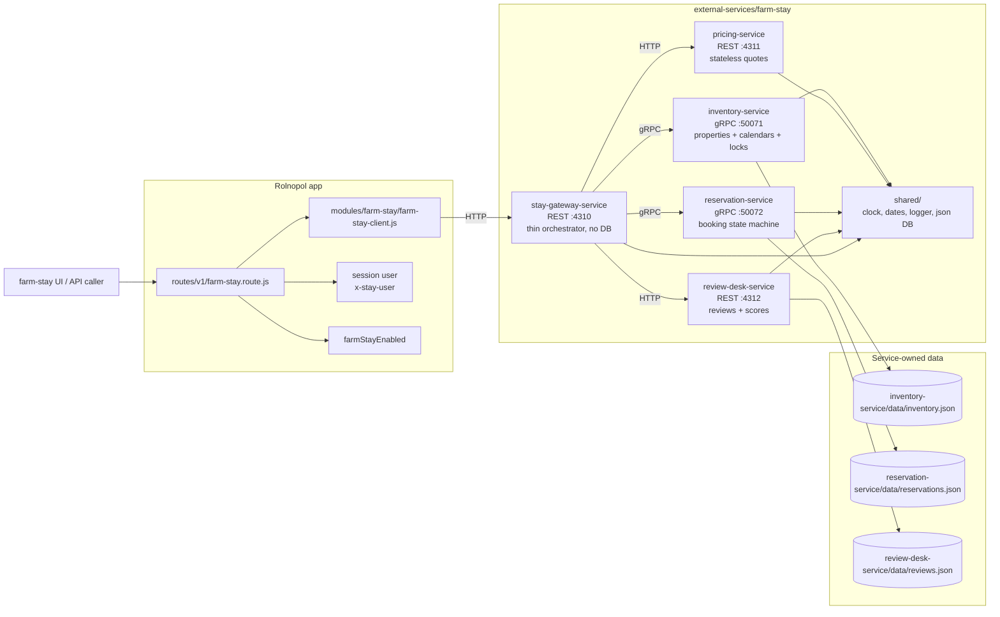
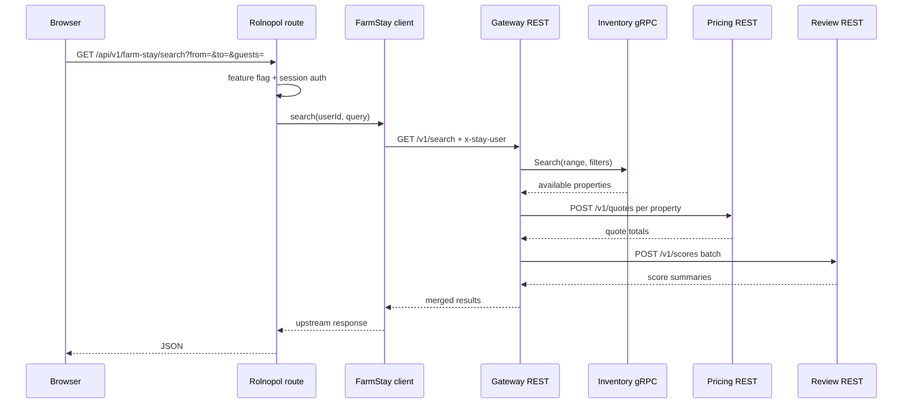
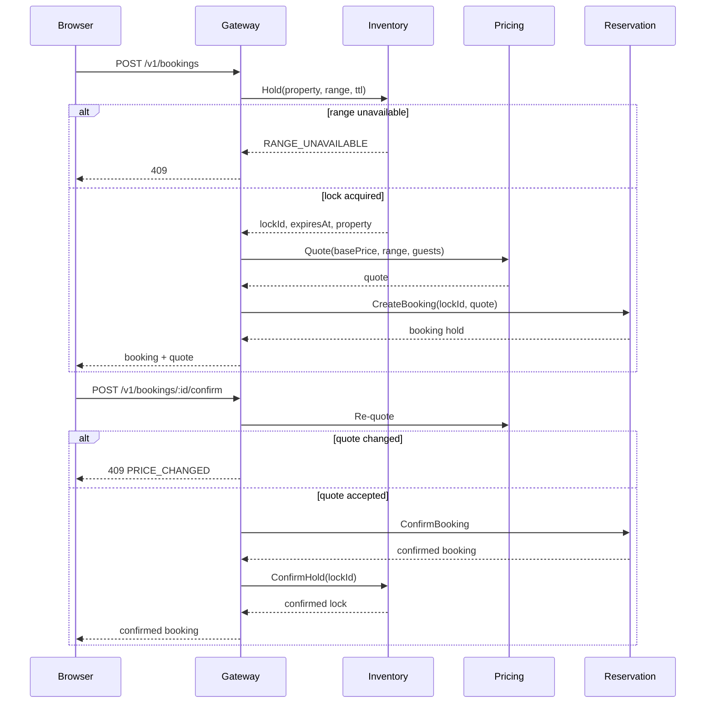
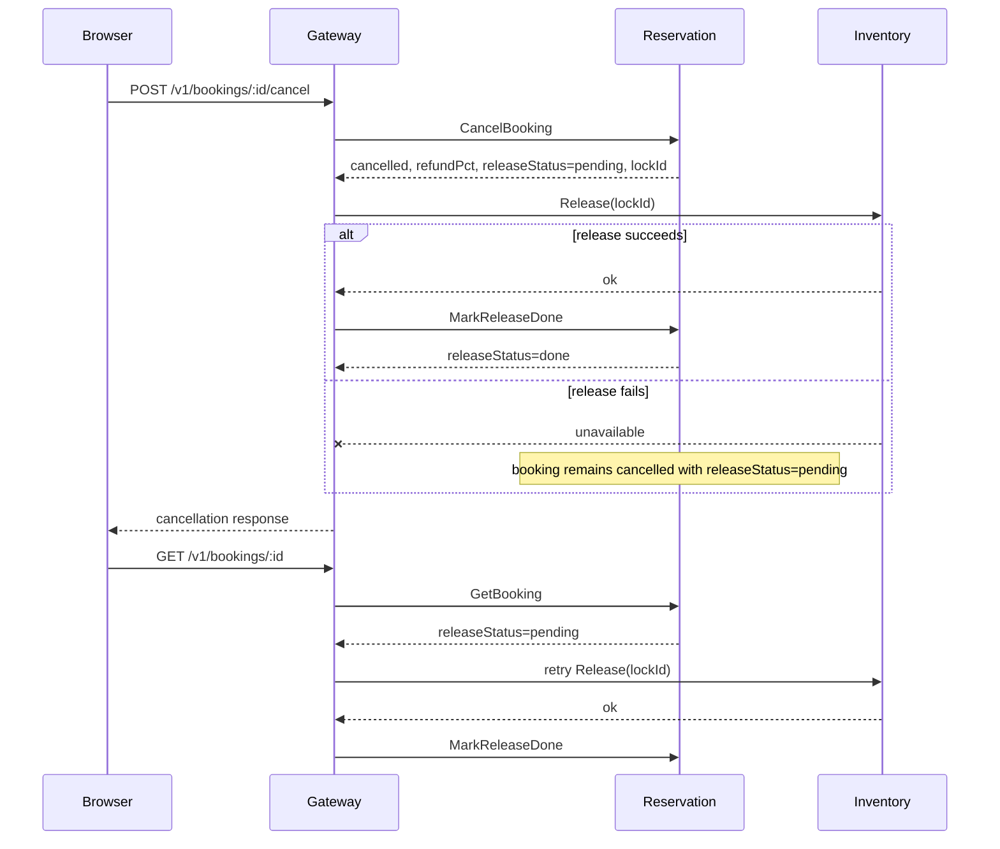
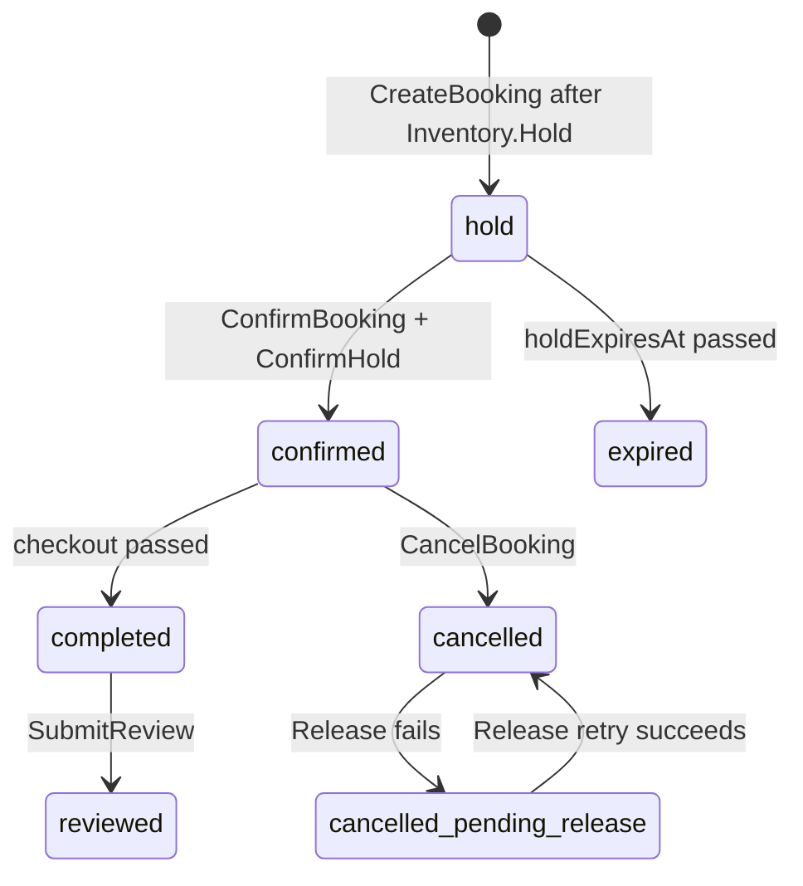
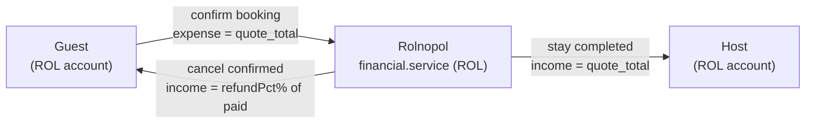
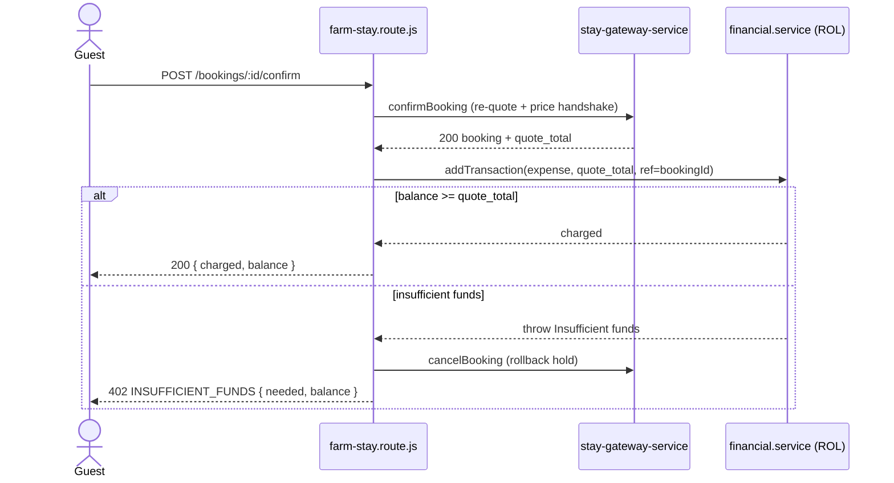
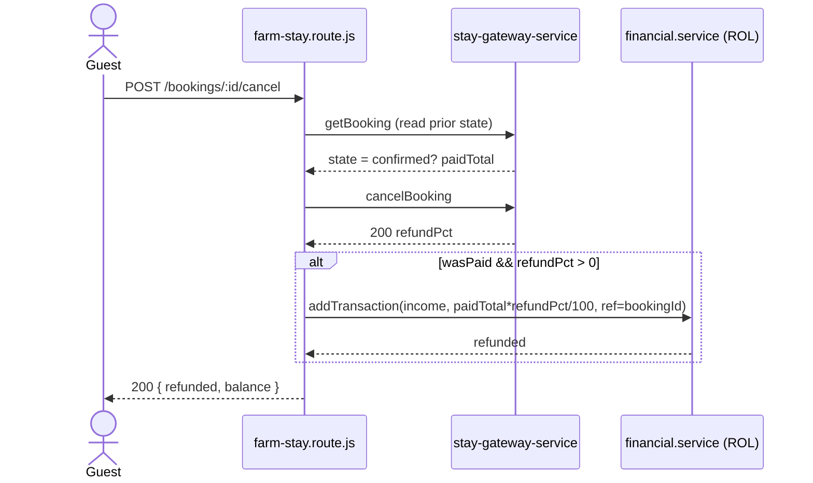
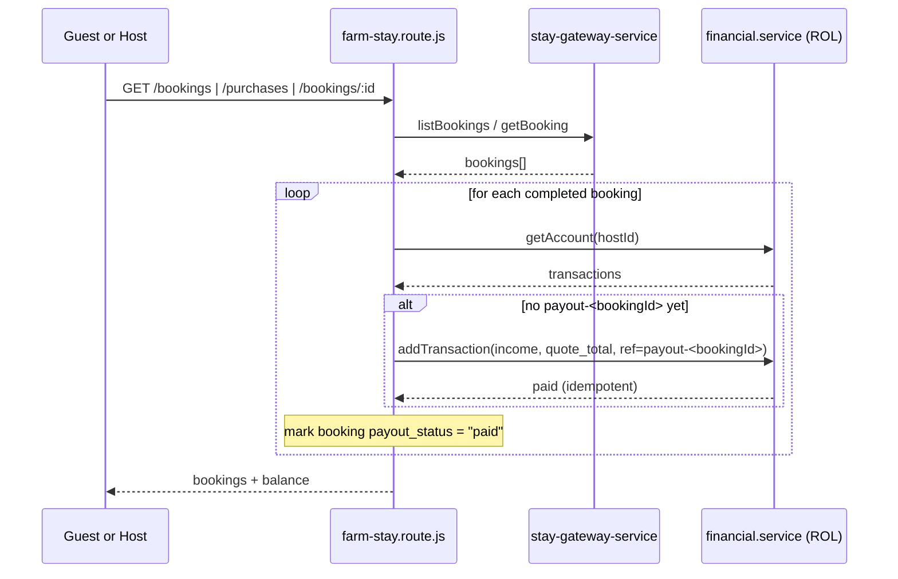
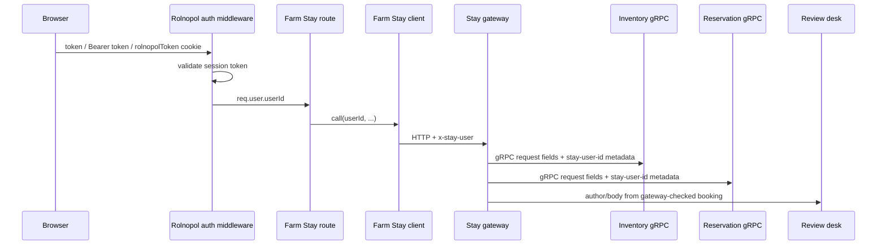

# Farm Stay External Service

Farm Stay is a booking.com-style farm stay marketplace implemented as a small
external-service ecosystem. Rolnopol talks to one service only: the
`stay-gateway-service`. The gateway owns no data; it forwards identity, orchestrates
leaf services, shapes responses, and maps errors.

## Architecture Diagram



## Services

| Service                | Runtime |    Port | Owns data | Responsibility                                                                      |
| ---------------------- | ------- | ------: | --------- | ----------------------------------------------------------------------------------- |
| `stay-gateway-service` | REST    |  `4310` | No        | Public Farm Stay API, identity forwarding, orchestration, health aggregation.       |
| `inventory-service`    | gRPC    | `50071` | Yes       | Property catalog, calendars, blackouts, atomic holds, confirmed locks.              |
| `pricing-service`      | REST    |  `4311` | No        | Deterministic quotes from base price, dates, guests, seasons, weekends, discounts.  |
| `reservation-service`  | gRPC    | `50072` | Yes       | Booking records, hold/confirm/cancel state machine, refund windows, release status. |
| `review-desk-service`  | REST    |  `4312` | Yes       | Reviews, duplicate-booking guard, property score aggregation.                       |

The leaf services do not call each other. All cross-service work starts at the
gateway.

## Directory Layout

```text
external-services/farm-stay/
├── README.md
├── PRD.md
├── services.js                 # service registry for supervisor/control CLI
├── start-all.js                # launches all five services + control endpoint
├── control.js                  # start/stop/restart/status control client
├── kill-all.js
├── shared/
│   ├── clock.js
│   ├── dates.js
│   ├── json-database.js
│   └── logger.js
├── stay-gateway-service/
│   ├── client-demo.js
│   ├── config.js
│   ├── clients/
│   ├── config/
│   └── server/
├── inventory-service/
│   ├── config.js
│   ├── config/
│   ├── data/
│   ├── protos/
│   └── server/
├── pricing-service/
│   ├── config.js
│   ├── config/
│   └── server/
├── reservation-service/
│   ├── config.js
│   ├── config/
│   ├── data/
│   ├── protos/
│   └── server/
└── review-desk-service/
    ├── config.js
    ├── data/
    └── server/
```

## Runtime Flow



## Booking Flow



## Cancellation and Release Repair



## State Model



## FarmStay Cash Flow

FarmStay is a booking marketplace, but **money never lives in the FarmStay
ecosystem** — it is handled entirely in Rolnopol's financial service (denominated
in **ROL**). The `routes/v1/farm-stay.route.js` bridge is the only place that
moves money: it charges the guest on confirm, refunds on cancel, and pays the
host once a stay completes. All amounts are rounded to 2 decimals.

### Money pools



### Confirm → charge ROL

On confirm the gateway re-quotes and runs a price-change handshake, then Rolnopol
debits the guest. If the balance is too low the confirmation is rolled back
(cancel releases the hold) and a `402` is returned — the stay is never held
unpaid.



### Cancel → refund ROL

Cancelling a _confirmed_ (already paid) booking refunds `refundPct%` of what was
paid back to the guest as income. The refund percentage comes from the gateway's
cancel response.



### Host payout sweep (completed stays)

A confirmed booking becomes `completed` once checkout passes (lazy, in the
reservation service). The first time _any_ party (guest or host) loads that
booking, Rolnopol credits the host's ROL balance with the stay total — exactly
once, keyed by `referenceId: payout-<bookingId>`. Bookings are grouped by host so
each host account is touched once per sweep.



> [!NOTE]
> 💡 The guest ledger is reconstructed from ROL transactions: a booking's charge
> is an `expense` tagged with the `bookingId`, and a refund is an `income` with
> the same reference. Host payouts use a `payout-<id>` reference and are excluded
> from the guest view. Downloadable PDF receipts are guest-only.

## Gateway API

Rolnopol proxies these as `/api/v1/farm-stay/*`. The gateway itself exposes the
same paths under `/v1/*` plus health endpoints.

```text
GET    /health
GET    /health/all
GET    /v1/catalog
GET    /v1/search?from=&to=&guests=&district=&type=&maxPrice=&sort=
GET    /v1/properties/:id?from=&to=
POST   /v1/properties
PATCH  /v1/properties/:id
DELETE /v1/properties/:id
GET    /v1/properties/mine
POST   /v1/properties/:id/blackouts
DELETE /v1/properties/:id/blackouts/:lockId
GET    /v1/properties/:id/reviews
POST   /v1/bookings
POST   /v1/bookings/:id/confirm
POST   /v1/bookings/:id/cancel
GET    /v1/bookings
GET    /v1/bookings/:id
POST   /v1/bookings/:id/review
```

## Run

```bash
npm run farmstay
npm run farmstay:demo
```

`npm run farmstay` starts all five services through `start-all.js`. Leaves start
before the gateway, and the supervisor exposes a control endpoint on
`FARM_STAY_CONTROL_PORT` or `4319`.

Run individual services when debugging:

```bash
npm run farmstay:inventory
npm run farmstay:pricing
npm run farmstay:reservation
npm run farmstay:reviews
npm run farmstay:gateway
```

Control a running supervisor:

```bash
npm run farmstay:control -- status
npm run farmstay:control -- stop pricing
npm run farmstay:control -- start pricing
npm run farmstay:control -- restart inventory
npm run farmstay:kill
```

## Environment

| Var                                               | Default                                            | Purpose                                          |
| ------------------------------------------------- | -------------------------------------------------- | ------------------------------------------------ |
| `STAY_GATEWAY_PORT` / `STAY_GATEWAY_HOST`         | `4310` / `0.0.0.0`                                 | Gateway bind address.                            |
| `INVENTORY_GRPC_PORT` / `INVENTORY_GRPC_HOST`     | `50071` / `0.0.0.0`                                | Inventory gRPC bind address.                     |
| `PRICING_PORT` / `PRICING_HOST`                   | `4311` / `0.0.0.0`                                 | Pricing REST bind address.                       |
| `RESERVATION_GRPC_PORT` / `RESERVATION_GRPC_HOST` | `50072` / `0.0.0.0`                                | Reservation gRPC bind address.                   |
| `REVIEW_DESK_PORT` / `REVIEW_DESK_HOST`           | `4312` / `0.0.0.0`                                 | Review REST bind address.                        |
| `INVENTORY_GRPC_TARGET`                           | `localhost:<inventory port>`                       | Gateway target for inventory.                    |
| `RESERVATION_GRPC_TARGET`                         | `localhost:<reservation port>`                     | Gateway target for reservation.                  |
| `PRICING_URL`                                     | `http://localhost:<pricing port>`                  | Gateway target for pricing.                      |
| `REVIEW_DESK_URL`                                 | `http://localhost:<review port>`                   | Gateway target for reviews.                      |
| `FARM_STAY_CONTROL_PORT`                          | `4319`                                             | Supervisor control server port.                  |
| `FARM_STAY_HOLD_TTL_SEC`                          | `600` in inventory, `0` from gateway means default | Hold TTL for booking locks.                      |
| `FARM_STAY_GRPC_DEADLINE_MS`                      | `3000`                                             | Gateway gRPC leaf deadline.                      |
| `FARM_STAY_HTTP_TIMEOUT_MS`                       | `3000`                                             | Gateway REST leaf timeout.                       |
| `FARM_STAY_HEALTH_TIMEOUT_MS`                     | `1500`                                             | Gateway aggregate health timeout.                |
| `FARM_STAY_TIME_OFFSET_MS`                        | unset                                              | Test/demo clock offset used by shared clock.     |
| `FARM_STAY_LOG`                                   | `info`                                             | Shared service log level; use `silent` in tests. |
| `INVENTORY_DB_PATH`                               | `inventory-service/data/inventory.json`            | Inventory data path.                             |
| `RESERVATIONS_DB_PATH`                            | `reservation-service/data/reservations.json`       | Reservation data path.                           |
| `REVIEWS_DB_PATH`                                 | `review-desk-service/data/reviews.json`            | Review data path.                                |

## App Integration

Rolnopol integrates only with the gateway:

- app client: [`modules/farm-stay/farm-stay-client.js`](../../modules/farm-stay/farm-stay-client.js)
- route bridge: [`routes/v1/farm-stay.route.js`](../../routes/v1/farm-stay.route.js)
- upstream base URL: `FARM_STAY_TARGET`, defaulting to `http://localhost:4310`
- identity: route sends the logged-in user as `x-stay-user`

The route also coordinates Rolnopol-side financial effects around confirmed,
cancelled, and completed bookings. Farm Stay services still remain the source of
truth for booking and stay state.

## User Identity and Security

Farm Stay does not issue or validate its own login tokens. User identity is
managed by Rolnopol and then forwarded into the Farm Stay ecosystem:



Security posture:

- The public Rolnopol route is protected by `authenticateSessionUser`, so personal
  API keys are not accepted for Farm Stay and anonymous callers get `401`.
- The gateway rejects every `/v1/*` request without `x-stay-user`.
- Gateway code derives host/guest/review author fields from `x-stay-user`; callers
  cannot choose another host or guest through the Rolnopol API.
- Inventory and reservation enforce ownership on sensitive operations such as
  listing updates, deletion, blackouts, booking lookup, confirmation, cancellation,
  and booking lists.
- Review eligibility is checked at the gateway from the caller's booking before
  the review desk writes the review; the review desk also rejects duplicate
  reviews for the same booking.

This is secure for the intended deployment boundary: browsers call Rolnopol,
Rolnopol calls only the gateway, and the Farm Stay gateway/leaves are private
internal services. It is not safe to expose the gateway or leaf services directly
to untrusted networks, because `x-stay-user`, gRPC request user fields, and review
authors are trusted internal inputs rather than signed service-to-service
credentials. If these services become network-public, add service authentication
or network policy before relying on the current identity model.

## Resilience Rules

- Inventory down means booking/search cannot safely continue.
- Pricing down degrades search quotes to unavailable, but hold/confirm returns `503`.
- Review desk down degrades scores/reviews, but booking remains available.
- Reservation down returns `503`; orphan inventory holds expire by TTL.
- Release after cancel is idempotent and repairable through `releaseStatus: "pending"`.

## Ownership Rules

- No Farm Stay service imports from Rolnopol app directories.
- Shared code lives only in `external-services/farm-stay/shared/`.
- Gateway and pricing stay stateless: no `data/` and no `db.js`.
- Inventory owns listings and calendars.
- Reservation owns booking lifecycle.
- Review desk owns reviews and score aggregation.
