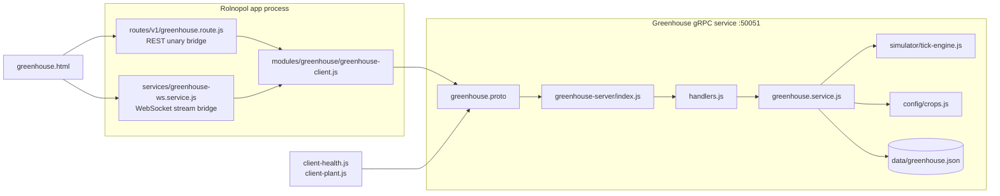
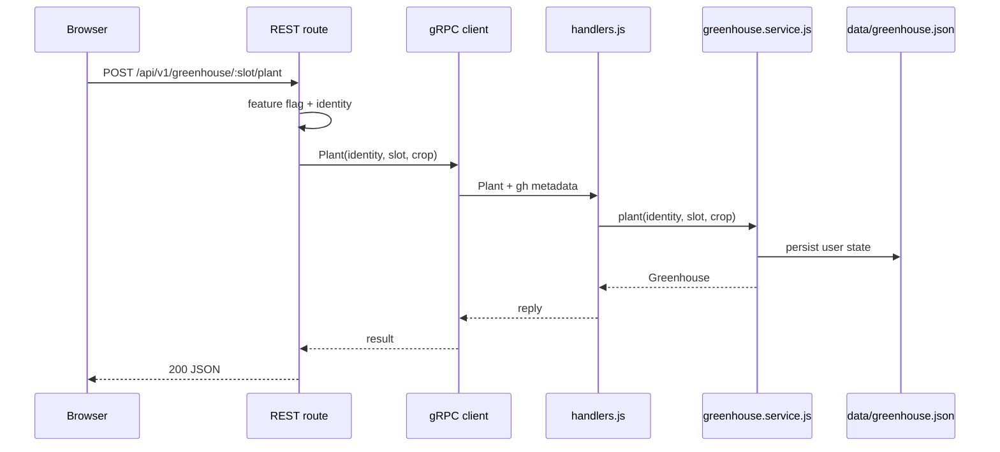
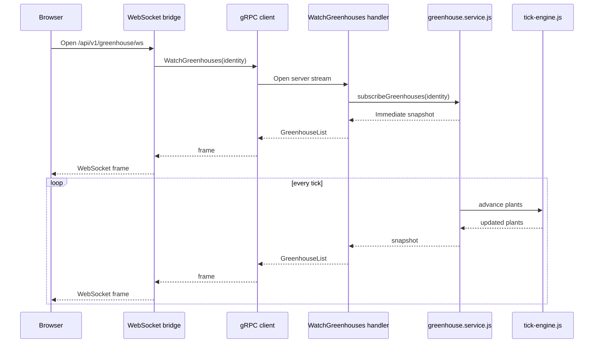

# Greenhouse Service

Greenhouse is the standalone "Grow-a-Plant" gRPC service for Rolnopol. It owns the
Greenhouse contract, server process, CLI demos, plant simulation, and persisted user
greenhouse state.

## Architecture



## Layout

```text
external-services/greenhouse/
├── greenhouse.proto              # GreenhouseControl + Health contract
├── greenhouse-config.js          # host/port/client target/proto-loader options
├── client-health.js              # CLI Health.Check probe
├── client-plant.js               # CLI unary grow-a-plant walkthrough
├── README.md
└── greenhouse-server/
    ├── index.js                  # boot, load proto, bind, graceful shutdown
    ├── handlers.js               # gRPC handlers and status mapping
    ├── greenhouse.service.js     # domain logic, sessions, tick loop
    ├── db.js                     # root data/greenhouse.json persistence
    ├── logger.js
    ├── config/crops.js           # crop catalog and slot count
    └── simulator/tick-engine.js  # deterministic plant growth tick
```

## RPC Surface

| RPC | Type | Purpose |
| --- | --- | --- |
| `Health.Check` | Unary | Reports serving status, DB initialization, crop count, version, uptime. |
| `GreenhouseControl.ListCrops` | Unary | Returns the crop catalog. |
| `GreenhouseControl.ListGreenhouses` | Unary | Returns the caller's three greenhouse slots and harvest count. |
| `GreenhouseControl.Plant` | Unary | Plants a crop in an empty slot. |
| `GreenhouseControl.Water` | Unary | Refills water for an occupied slot. |
| `GreenhouseControl.Harvest` | Unary | Harvests a ripe plant and frees the slot. |
| `GreenhouseControl.WatchGreenhouses` | Server stream | Pushes live slot snapshots while plants grow. |

## Request Flows

### Unary Planting



### Live Growth Stream



## Domain Details

- Each identity owns exactly three greenhouse slots.
- A slot is either empty or contains one plant.
- Water starts at `100` and drains each tick.
- Growth only advances while the plant has water.
- Growth reaches `100` when a crop has received its configured watered tick count.
- Ripe plants can be harvested; harvesting increments the identity's lifetime count.
- Logged-in user state is persisted. Anonymous demo state is memory-only.
- The tick loop is lazy: it starts when there are stream subscribers and stops when idle.

## Identity

Greenhouse supports logged-in users and anonymous demo visitors. Identity is passed
as gRPC metadata:

| Metadata | Meaning |
| --- | --- |
| `gh-identity` | User id or browser demo id. |
| `gh-identity-kind` | `user` or `demo`. |

The app route resolves identity from the session token first. If no user is logged
in, the browser sends `x-greenhouse-demo-id`, which the route forwards as demo
metadata.

## Run

```bash
npm run greenhouse
npm run greenhouse:health
npm run greenhouse:plant
```

`npm run greenhouse` starts the service on `GREENHOUSE_GRPC_PORT` or `50051`.
The CLI clients dial `GREENHOUSE_GRPC_TARGET` or `localhost:<port>`.

## Test

```bash
npm run greenhouse:test
```

This runs the Greenhouse unit tests, direct gRPC integration tests, REST proxy tests,
and page-gating tests.

## Environment

| Var | Default | Purpose |
| --- | --- | --- |
| `GREENHOUSE_GRPC_PORT` | `50051` | Server bind port. Use `0` for ephemeral test ports. |
| `GREENHOUSE_GRPC_HOST` | `0.0.0.0` | Server bind host. |
| `GREENHOUSE_GRPC_TARGET` | `localhost:<port>` | Address clients dial. |
| `GREENHOUSE_TICK_MS` | `1000` | Plant growth tick interval. |
| `GREENHOUSE_DB_PATH` | `data/greenhouse.json` | Persistence path, overridable for tests. |

## Integration Notes

The Rolnopol app does not hold Greenhouse domain state. Browser REST requests flow
through [`routes/v1/greenhouse.route.js`](../../routes/v1/greenhouse.route.js), which
uses [`modules/greenhouse/greenhouse-client.js`](../../modules/greenhouse/greenhouse-client.js)
to load this service's config and contract.
