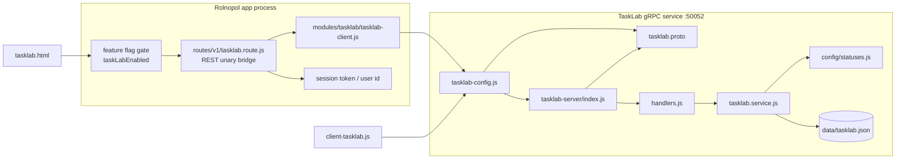
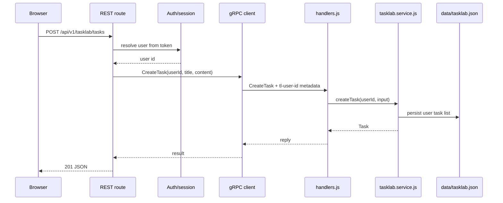
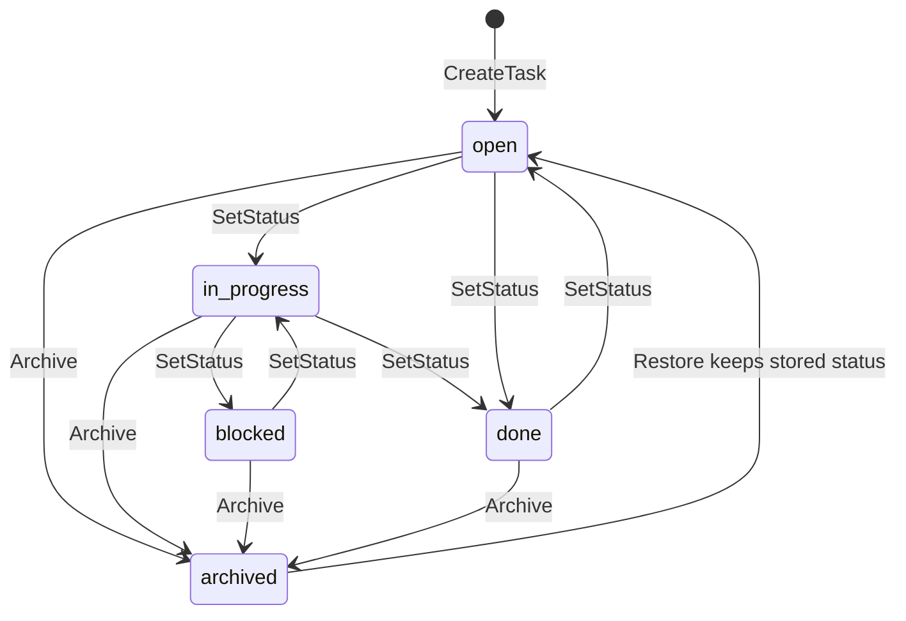

# TaskLab Service

TaskLab is the standalone gRPC task service for Rolnopol. It owns the TaskLab
contract, server process, CLI demo, task status catalog, and persisted per-user task
state.

## Architecture Diagram



## Layout

```text
external-services/tasklab/
├── tasklab.proto                 # TaskControl + Health contract
├── tasklab-config.js             # host/port/client target/proto-loader options
├── client-tasklab.js             # CLI end-to-end task walkthrough
├── README.md
└── tasklab-server/
    ├── index.js                  # boot, load proto, bind, graceful shutdown
    ├── handlers.js               # gRPC handlers and status mapping
    ├── tasklab.service.js        # domain logic and validation
    ├── db.js                     # root data/tasklab.json persistence
    ├── logger.js
    └── config/statuses.js        # status catalog and length limits
```

## RPC Surface

| RPC | Type | Purpose |
| --- | --- | --- |
| `Health.Check` | Unary | Reports serving status, DB initialization, status count, version, uptime. |
| `TaskControl.ListStatuses` | Unary | Returns valid statuses and field length limits. |
| `TaskControl.ListTasks` | Unary | Lists caller tasks with optional status, search, and archived filtering. |
| `TaskControl.CreateTask` | Unary | Creates a task for the caller. |
| `TaskControl.SetStatus` | Unary | Moves a task to another valid status. |
| `TaskControl.Archive` | Unary | Marks a task archived. |
| `TaskControl.Restore` | Unary | Restores an archived task to active lists. |

## Request Flow



## Domain Details

- TaskLab is login-only. Every domain RPC needs `tl-user-id` metadata.
- Each user owns a private task list and a per-user id counter.
- Tasks have `id`, `title`, `content`, `status`, `archived`, `created_at`, and `updated_at`.
- Valid statuses are defined in `tasklab-server/config/statuses.js`.
- `ListTasks` can filter by status, search title/content, and include archived tasks.
- Archived tasks remain in the store but are hidden from default lists.
- The service persists state through the root JSON database at `data/tasklab.json`.

## State Model



`Restore` unarchives the task and preserves its stored status. The diagram labels
the restore edge to `open` only as a visual simplification for returning to the
active task list.

## Identity

TaskLab identity is passed with one gRPC metadata key:

| Metadata | Meaning |
| --- | --- |
| `tl-user-id` | Logged-in Rolnopol user id. |

The REST route resolves this from the app session token. Missing identity is a
domain validation failure and maps back through gRPC/REST error handling.

## Run

```bash
npm run tasklab
npm run tasklab:demo
```

`npm run tasklab` starts the service on `TASKLAB_GRPC_PORT` or `50052`.
The CLI client dials `TASKLAB_GRPC_TARGET` or `localhost:<port>`.

## Test

```bash
npm run tasklab:test
```

This runs the TaskLab unit tests, direct gRPC integration tests, REST proxy tests,
and page-gating tests.

## Environment

| Var | Default | Purpose |
| --- | --- | --- |
| `TASKLAB_GRPC_PORT` | `50052` | Server bind port. Use `0` for ephemeral test ports. |
| `TASKLAB_GRPC_HOST` | `0.0.0.0` | Server bind host. |
| `TASKLAB_GRPC_TARGET` | `localhost:<port>` | Address clients dial. |
| `TASKLAB_DB_PATH` | `data/tasklab.json` | Persistence path, overridable for tests. |
| `TASKLAB_DEMO_USER` | `demo-cli-user` | User id used by `npm run tasklab:demo`. |

## Integration Notes

The Rolnopol app does not hold TaskLab domain state. Browser REST requests flow
through [`routes/v1/tasklab.route.js`](../../routes/v1/tasklab.route.js), which uses
[`modules/tasklab/tasklab-client.js`](../../modules/tasklab/tasklab-client.js) to load
this service's config and contract.
