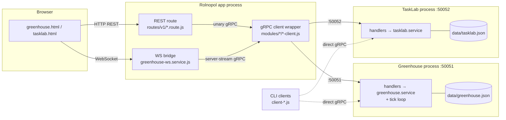
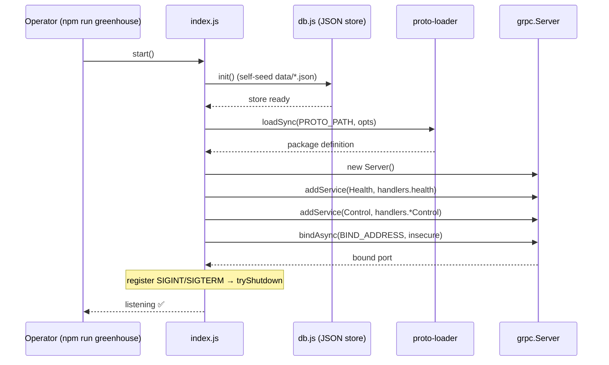
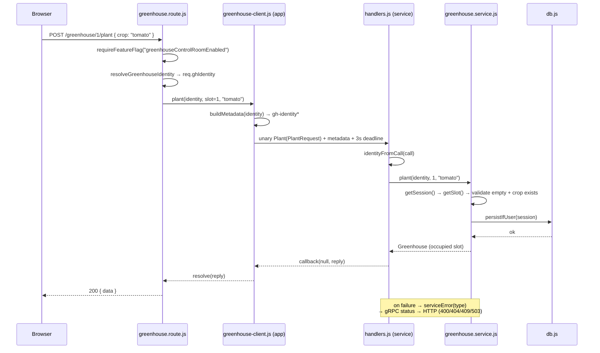
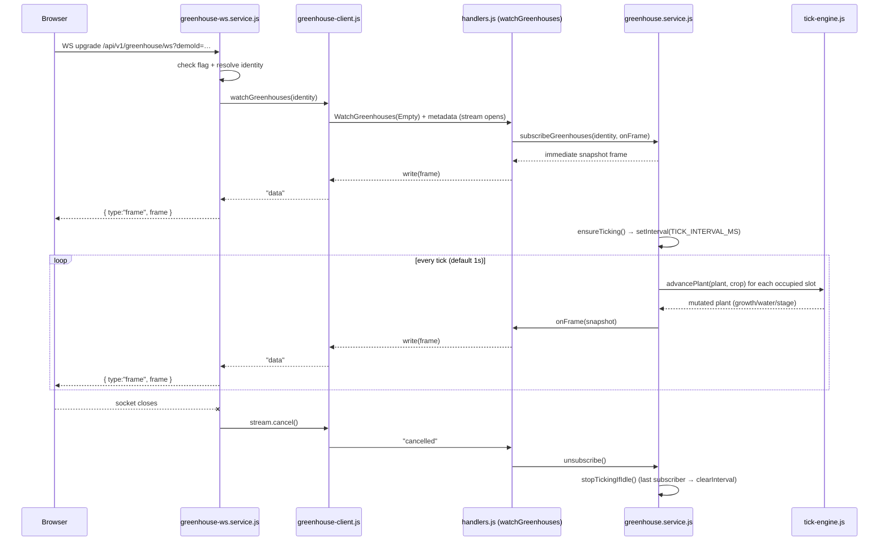

# gRPC Module

This directory holds two **standalone gRPC microservices** and the CLI clients that
exercise them. The Rolnopol app itself owns no domain logic for either service — it
is only a **gRPC client** that proxies browser requests over the wire.

| Service        | Codename       | Port (default) | Proto                     | Scope                          |
| -------------- | -------------- | -------------- | ------------------------- | ------------------------------ |
| **Greenhouse** | "Grow-a-Plant" | `50051`        | [`protos/greenhouse.proto`](protos/greenhouse.proto) | Everyone (users + anon demos)  |
| **TaskLab**    | "TaskLab"      | `50052`        | [`protos/tasklab.proto`](protos/tasklab.proto)    | Logged-in users only           |

Both services share the same shape: a standalone Node process owns its own JSON
store, registers a `Health` probe plus a domain service, and is reached either by a
CLI client or by the web app's thin client wrapper. The `.proto` contract is the
single source of truth — it is loaded at runtime by **both** the server process and
every client (no codegen step).

---

## Directory layout

```
grpc/
├── protos/
│   ├── greenhouse.proto          # Greenhouse + Health contract
│   └── tasklab.proto             # TaskLab + Health contract
│
├── greenhouse-config.js          # shared host/port/proto-loader opts (greenhouse)
├── tasklab-config.js             # shared host/port/proto-loader opts (tasklab)
│
├── greenhouse-server/            # PROCESS — greenhouse service (port 50051)
│   ├── index.js                  #   boot, load proto, bind, graceful shutdown
│   ├── handlers.js               #   thin: wire ⇄ service, metadata→identity, errors→status
│   ├── greenhouse.service.js     #   domain logic + per-identity sessions + tick loop
│   ├── db.js                     #   JSON store (data/greenhouse.json), users only
│   ├── logger.js
│   ├── config/crops.js           #   crop catalog + slot count
│   └── simulator/tick-engine.js  #   pure plant-growth advancement (1 tick)
│
├── tasklab-server/               # PROCESS — tasklab service (port 50052)
│   ├── index.js
│   ├── handlers.js
│   ├── tasklab.service.js
│   ├── db.js                     #   JSON store (data/tasklab.json)
│   ├── logger.js
│   └── config/statuses.js        #   status catalog + length limits
│
├── client-health.js              # CLI: greenhouse Health.Check demo
├── client-plant.js               # CLI: greenhouse unary walkthrough
└── client-tasklab.js             # CLI: tasklab end-to-end walkthrough
```

The web-app side lives outside this directory:

- [`modules/greenhouse/`](../modules/greenhouse) and [`modules/tasklab/`](../modules/tasklab) — app-side gRPC client wrappers + identity.
- [`routes/v1/greenhouse.route.js`](../routes/v1/greenhouse.route.js) / [`routes/v1/tasklab.route.js`](../routes/v1/tasklab.route.js) — REST→gRPC proxy routes.
- [`services/greenhouse-ws.service.js`](../services/greenhouse-ws.service.js) — WebSocket→gRPC bridge for the browser live feed.

---

## The two-process model

The browser can't speak native gRPC, and the standalone services run in their own
processes. So a request flows through three hops:



Key consequences:

- **App holds no domain data.** Every greenhouse/tasklab read or write is a gRPC
  call; the JSON stores belong to the service processes only.
- **Resilience over restart.** The client wrappers cap grpc-js reconnect backoff
  low and drop the cached channel on `UNAVAILABLE`/`DEADLINE_EXCEEDED`, so a service
  that starts *after* the app is picked up on the next request — no app restart
  needed.
- **Error translation.** Domain errors carry a `.type`
  (`NOT_FOUND` / `INVALID_ARGUMENT` / `FAILED_PRECONDITION`) → handlers map to gRPC
  status codes → REST routes map those to HTTP (`404` / `400` / `409`, and
  `UNAVAILABLE`→`503`).

---

## Identity propagation

Neither service has its own auth. Callers pass identity as **gRPC metadata**, which
handlers read off the call:

| Service    | Metadata key(s)                     | Source                                                          |
| ---------- | ----------------------------------- | --------------------------------------------------------------- |
| Greenhouse | `gh-identity`, `gh-identity-kind`   | session token → `user`; else browser `x-greenhouse-demo-id` → `demo` |
| TaskLab    | `tl-user-id`                        | session token only (login required; absent → `INVALID_ARGUMENT`) |

Greenhouse state is scoped per identity: `user` identities are persisted to the
store, `demo` identities live in memory and are evicted after a 30-minute idle TTL.

---

## Service boot sequence

Both `index.js` files follow the same startup path:



The DB is seeded **before** the server binds, so traffic never hits an uninitialized
store. Shutdown is graceful: `tryShutdown` drains in-flight calls, falling back to
`forceShutdown` if that fails.

---

## Unary call: planting through the full stack

A `POST /api/v1/greenhouse/:slot/plant` from the browser is the canonical unary
path — flag gate, identity resolution, gRPC hop, then error mapping back to HTTP.



The CLI client ([`client-plant.js`](client-plant.js)) walks the same unary RPCs
(`ListCrops → ListGreenhouses → Plant → Water → ListGreenhouses`) but dials the
service directly, bypassing the app.

---

## Server streaming: the live growth feed

The greenhouse simulates plant growth on a per-session tick loop and streams a frame
each tick over `WatchGreenhouses` (server streaming). The browser receives it via a
WebSocket bridge, since it can't consume gRPC streams directly.



Notes:

- **Tick loop is lazy.** It starts on the first subscriber (`ensureTicking`) and
  stops when the last one leaves (`stopTickingIfIdle`) — no idle CPU.
- **`tick-engine.js` is pure & deterministic.** A watered plant grows toward
  ripeness at a crop-specific rate; water drains 5/tick; a thirsty plant (water 0)
  stalls. Determinism lets unit tests assert exact progression.
- **Offline handling.** If the service is down, the WS bridge forwards
  `{ type:"error", offline:true }` so the UI can prompt `npm run greenhouse`.

---

## Running it

```bash
# Greenhouse service (port 50051) + demos
npm run greenhouse              # start the service process
npm run greenhouse:health       # CLI: Health.Check
npm run greenhouse:plant        # CLI: unary walkthrough

# TaskLab service (port 50052) + demo
npm run tasklab                 # start the service process
npm run tasklab:demo            # CLI: end-to-end walkthrough

# Tests (unit + gRPC integration + REST + page gating)
npm run greenhouse:test
npm run tasklab:test
```

Each service is gated in the app by a feature flag
(`greenhouseControlRoomEnabled` / `taskLabEnabled`); with the flag off, the routes
and WS upgrade return `404`.

### Configuration (env)

| Var                                              | Default       | Purpose                              |
| ------------------------------------------------ | ------------- | ------------------------------------ |
| `GREENHOUSE_GRPC_PORT` / `TASKLAB_GRPC_PORT`     | `50051/50052` | bind port (`0` = ephemeral, tests)   |
| `GREENHOUSE_GRPC_HOST` / `TASKLAB_GRPC_HOST`     | `0.0.0.0`     | bind host                            |
| `GREENHOUSE_GRPC_TARGET` / `TASKLAB_GRPC_TARGET` | `localhost:<port>` | address clients dial            |
| `GREENHOUSE_TICK_MS`                             | `1000`        | growth tick interval                 |
| `GREENHOUSE_DB_PATH` / `TASKLAB_DB_PATH`         | `data/*.json` | store path (overridable for tests)   |

The proto-loader options (`keepCase`, `longs:String`, `enums:String`, `defaults`,
`oneofs`) are defined once in each `*-config.js` and shared by server and clients so
message shapes always match across the wire.
```